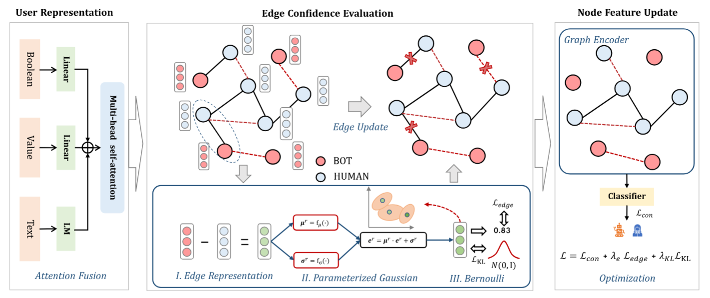

**阶段 A：semantic encoder → GNN**

**阶段 B：GNN 输出 → post-hoc estimator**

**阶段 C：risk/regime → local semantic enhancement**

**阶段 D：risk/regime → local propagation repair**

**阶段 E：action selection**

**阶段 F：same-head refinement**

**阶段 G：positioning / stress test**


## Related work

### GLEM: Learning on large-scale text-attributed graphs via variational inference (ICLR 2023)

**Motivation**: **Static LM-embedding + GNN** （LM 的语义空间不是由最终图任务共同塑造的，缺少 topology/task joint adaptation）

LM 先生成节点特征，然后 GNN 训练时这些特征固定不变；因此 GNN 的 loss 不能反传更新 LM，语义空间不会被图结构和最终任务共同塑造。LM embedding 对 GNN 来说只是 **static features / frozen node features**。

**static LM embedding 在 GNN 训练阶段不可学习**。GNN 只能学习如何聚合这些 embedding，但不能让 LM 根据图结构、邻居标签、下游任务误差重新调整文本表征。

**Methology**: EM 让 LM 与 GNN 交替蒸馏、相互增强


### Exploring the potential of large language models (LLMs) in learning on graphs (NIPS 2023)

**Motivation**: **LLMs作为增强工具** 和 **LLMs作为预测工具**。前者利用LLMs通过其庞大的知识增强节点的文本属性，然后通过 GNNs 生成预测。而后者则试图直接将 LLMs 作为独立的预测工具。


### SimTeG: a frustratingly simple approach improves textual graph learning (ICLR 2024)

**Motivation**: **finetuned LM + GNN** （在很多 TAG benchmark 上，瓶颈不一定首先是 LM-GNN 联合训练，而是输入给 GNN 的文本特征太差。）

经过任务监督 PEFT 得到的高质量文本表征，在任务标签上被适配过，不再是纯 pretrained 或纯 domain-adaptive embedding，仍然可以成为极强、极便宜的 baseline


### Harnessing Explanations: LLM-to-LM Interpreter for Enhanced Text-Attributed Graph Representation Learning (ICLR 2024)

**Motivation**: **LMaaS** prompting a powerful LLM to explain its predictions, 

we extract its relevant prior knowledge and reasoning steps, making this information digestible for smaller models, akin to how human experts use explanations to convey insights.


### GAugLLM: Improving Graph Contrastive Learning for Text-Attributed Graphs with Large Language Models (KDD 2024)

https://github.com/NYUSHCS/GAugLLM.

**Motivation** : 一是文本增强通常只在数值特征空间里做随机扰动，无法充分保持或利用原始文本语义；二是文本属性和图结构并不天然对齐，因此只基于文本相似度做结构增强会产生不可靠图结构。

**Method** :

1.  **feature augmentation**: mixture-of-prompt-experts ，不是所有 hard node 都应该用同一种 LLM evidence
2.  **collaborative edge modifier** : 只靠文本空间做边增强会有二次复杂度和文本—结构不对齐问题，因此需要结构候选生成 + 文本语义确认，同时利用结构空间与文本空间进行边增删。（GNN/graph estimator 生成局部候选，再由LM证据判断是否需要 prune、reweight 或 add）


### Can LLMs effectively leverage graph structural information through prompts, and why?  (TMLR 2024)

**Results:**

1. LLMs其实并不将提示理解为图结构。相反，**LLMs更像是将提示理解为带有增强关键词的段落**。因此，当邻域是同质的时，LLMs仅在结构信息的帮助下表现出改善。显式使用 “hop”“neighbor” 这样的结构词能够提升模型进入 graph-reasoning mode 的能力；把结构表达改成更自然但不明确的 “related papers”等，会显著降低性能。
2. 当目标节点本身包含**丰富的相关短语**时，额外的结构信息变得多余。
3. 我们的结果暗示LLMs可能**依赖于浅层的、表面层次的模式**，而不是掌握图结构的潜在关系复杂性。未来的研究可能旨在开发能使LLMs深入解析和理解图拓扑结构的方法


### LOGIN: a large language model consulted graph neural network training framework （WSDM 2025）

**Motivation**: **GNN-centered consulting loop**

LLM 作为外部证据源修正语义表征，显式参与 GNN training，而不是单独预测或一次性预处理增强。选择 uncertain nodes，构造包含语义与拓扑信息的 prompt，然后根据 LLM response 的正确性分别做 semantic feature update 或 structure refinement。


### Taming language models for text-attributed graph learning with decoupled aggregation (ACL 2025)

**Motivation**: 将节点聚合与图卷积解耦，并将其整合到文本表示学习过程中 


### Glance for context: learning when to leverage LLMs for node-aware GNN-LLM fusion (ICLR 2026)

**Motivation**: 

GNNs 与 LLMs 的性能可能存在显著差异，而且二者各自**擅长不同的结构模式**，因此相较于在所有节点上统一应用，应该重新审视LLMs 何时真正带来收益，将 LLM–GNN 融合重新聚焦于那些 GNNs 通常表现不佳的节点上。


---

## BotDetection Baseline


### Dispelling the fake: social bot detection based on edge confidence evaluation （CCF-B）





### BotBR: social bot detection with balanced feature fusion and reliability-enhanced graph learning （2025 CCF-A）


---

## 三种候选路线

**Route-A：LOGIN-style consulted detector。**

流程是：GNN 找困难节点，LLM 给 prediction/rationale，GNN 用 response 修正。优点是实现快，缺点是 LOGIN 已经占位，social bot detection 只是应用迁移。除非你在 bot-specific prompt 和 coping mechanism 上有很强设计，否则不推荐作为主线。


**Route-B：GNN-pruned LLM local evidence graph rewriting。**

流程是：GNN 压缩局部证据图，LLM 审查 evidence graph，输出 edge-level edits，GNN 在 rewritten evidence graph 上更新。这个路线是我目前最推荐的，因为它把创新点放在 “how to call LLM”：不是 call node，而是 call pruned evidence graph；不是让 LLM 直接预测，而是让 LLM 修改图证据。


**Route-C：Full GraphEdit-style LLM-guided graph structure learning for bot detection。**

流程是：LLM 全局判断边添加/删除，重写社交图，然后训练 GNN。这个最激进，可能性能好，但论文身份会漂移到 Graph Structure Learning，而且成本、可复现性、边编辑合法性都很难防守。


**Route-D：Iterative GNN-LLM co-training / co-editing。**

流程是多轮 GNN pruning、LLM editing、GNN retraining。它最强，但实验复杂度高；建议作为 Route-B 的增强实验，不作为 v1 主线。


$$
\text{Route-B} > \text{Route-D as extension} > \text{Route-A} > \text{Route-C}
$$


在prompt中考虑加入contrasitive samples

LM - Evidence / GNN - estimator - judgement


---

## Model pipeline

当前模型可以总结为：

```
LM + GNN outputs
  -> conformal ego-quality estimator Q_phi
  -> hard-node v
  -> Local Ego Retrieval
      -> writable propagation candidates
      -> non-writable virtual context candidates
      -> evidence candidates
  -> local graph rewriter
  -> Q_phi post-check / rollback
  -> ego-evidence graph
  -> optional LLM embedding/refiner
```


```text
RoBERTa node embeddings + original graph
  -> base GNN prediction
  -> conformal ego-graph quality estimator
  -> hard-node router
  -> semantic/structural local ego retrieval
  -> text-graph coupled edge modifier
  -> existing-edge soft rewrite
  -> trusted refined ego-graph artifact
  -> optional evidence ego prompt / LLM embedding
  -> final refiner prediction
```

**1. 输入与基础检测器**

输入包括：

```text
X_R = Stage 1 RoBERTa node embeddings
A   = original social graph
p_g, h_g = base GNN posterior / hidden representation
```

复用已有语义表示和原始图结构，给后续 estimator 和 ego refinement 提供稳定输入。


参考文献：  
[GLEM, ICLR 2023](https://openreview.net/forum?id=q0nmYciuuZN) 支持 LM 与 GNN 可以互相增强；[Graph Meets LLM Survey, IJCAI 2024](https://www.ijcai.org/proceedings/2024/898) 支持把研究定位为 LLM/GNN enhancer ，而不是 LLM 直接分类器。


**2. Conformal Ego-Graph Quality Estimator**

基础 GNN 输出后，不直接进入 LLM，而是先用 conformal estimator 判断当前节点 ego-graph 的质量：

```text
Q_phi(Ego_v, X_R, A_v) -> {
  prediction_set,
  set_size,
  coverage_margin,
  abstain_risk,
  calibration_metadata
}
```

核心作用是把“这个节点难不难、当前 ego 图是否可信”表示成 prediction-set的质量信号，而不是单一 confidence。

参考文献：  
[CF-GNN, NeurIPS 2023](https://proceedings.neurips.cc/paper_files/paper/2023/hash/54a1495b06c4ee2f07184afb9a37abda-Abstract-Conference.html) 支持 graph conformal prediction set；[DAPS/NAPS, ICML 2023](https://proceedings.mlr.press/v202/h-zargarbashi23a.html) 支持用图扩散增强 conformity score；[SNAPS, NeurIPS 2024](https://openreview.net/forum?id=iBZSOh027z) 支持结合 feature similarity 和 structural neighborhood；[GATS](https://proceedings.neurips.cc/paper_files/paper/2022/hash/5975754c7650dfee0682e06e1fec0522-Abstract-Conference.html) / [CaGCN](https://proceedings.neurips.cc/paper/2021/hash/c7a9f13a6c0940277d46706c7ca32601-Abstract.html) 作为 calibration baseline。

**3. Hard-Node Router**

用 estimator 输出和已有 residual-risk selector 选出需要 refinement 的节点：

```text
hard_v = Router(
  abstain_risk,
  set_size,
  coverage_margin,
  base_gnn_uncertainty,
  residual_risk_manifest
)
```

router 只决定是否局部 refinement。

参考文献：  
[GLANCE, ICLR 2026](https://openreview.net/forum?id=oODFyykHF5) 支持只在 GNN 不擅长的节点上选择性使用 LLM/refiner；[LOGIN, WSDM 2025](https://doi.org/10.1145/3701551.3703488) 支持对 uncertain/spotted nodes 构造语义+拓扑上下文。


**4. Local Ego Retrieval**

对 hard node 构造两路候选：

```text
Semantic candidates:
  RoBERTa embedding kNN / semantically similar nodes

Structural candidates:
  existing ego edges / k-hop / PPR / Jaccard / local structure ranking
```

候选分两类：

```text
propagation_edges:
  已存在于 ego graph，可 soft reweight

virtual_context_edges:
  检索得到的潜在上下文，只进入 artifact / prompt，不写回主图
```

参考文献：  
[SKETCH/Taming, ACL 2025](https://aclanthology.org/2025.acl-long.173/) 支持 semantic aggregation 与 structural aggregation 解耦；[CTGL, COLING 2025](https://aclanthology.org/2025.coling-main.722/) 支持 text graph coupled augmentation；[GAugLLM, KDD 2024](https://arxiv.org/abs/2406.11945) 支持结构候选和文本 commonality 联合决定 edge modification。


**5. Text-Graph Coupled Edge Modifier**

对已有 ego 边做文本-图联合打分：

```text
z_text(e)  = TextPairEncoder(X_R[v], X_R[u])
z_graph(e) = LocalGraphPairEncoder(Ego_v, e, X_R, Q_phi)
z_e        = CoupledGate(z_text(e), z_graph(e), Q_phi(Ego_v))
```

输出候选空间：

```text
s_reliability(e)  # binary / scalar reliability
u_edge(e)         # continuous propagation utility
p_role(e)         # optional evidence-aware roles
```

反事实边干预作为候选监督来源：

```text
Delta_down(e), Delta_drop(e), Delta_up(e)
```

四类 `supportive / suspicious / neutral / uncertain` 只是候选 hypothesis，不是最终定案。

参考文献：  
[BotBR, SIGIR 2025](https://doi.org/10.1145/3726302.3729908) 和 [BECE, TNNLS 2025](https://ieeexplore.ieee.org/document/10530431/) 是 social bot edge reliability 的强相关边界；[GAugLLM](https://arxiv.org/abs/2406.11945) 和 [CTGL](https://aclanthology.org/2025.coling-main.722/) 支持文本-图联合 modifier；[GNNExplainer](https://papers.nips.cc/paper_files/paper/2019/hash/d80b7040b773199015de6d3b4293c8ff-Abstract.html)、[PGExplainer](https://proceedings.neurips.cc/paper/2020/hash/e37b08dd3015330dcbb5d6663667b8b8-Abstract.html)、[GraphMask](https://arxiv.org/abs/2010.00577) 支持 edge importance / mask 思想。


**6. Soft Graph Rewrite**

只 soft-reweight 已有 ego edges：

```text
w_e_next = w_e * clip(
  1 + lambda * budget_v * modifier_score(e) * (1 - uncertainty_e),
  1 - lambda,
  1 + lambda
)
```

不 hard delete，不把新增候选边写回主图。低效用或 suspicious 边可以降权，但保留为证据。

参考文献：  
[LDS, ICML 2019](https://proceedings.mlr.press/v97/franceschi19a.html) 支持 edge probability；[Pro-GNN, KDD 2020](https://www.kdd.org/kdd2020/accepted-papers/view/graph-structure-learning-for-robust-graph-neural-networks.html) 支持 robust graph structure learning；[GNNGuard, NeurIPS 2020](https://proceedings.neurips.cc/paper/2020/hash/690d83983a63aa1818423fd6edd3bfdb-Abstract.html) 支持 learned edge weighting。


**7. Trusted Refined Ego-Graph Artifact**

输出一个证据化 ego artifact：

```text
target node summary
base posterior / conformal set / abstain risk
supportive or high-utility evidence
suspicious or low-utility evidence
uncertain edges
semantic context
structural context
before/after quality score
rewrite budget and provenance
```

这用于诊断和 GNN refiner，后续再转成 LLM prompt。

参考文献：  
[GraphText](https://arxiv.org/abs/2310.01089) 支持 graph-to-text；[Can LLMs Effectively Leverage Graph Structural Information through Prompts, TMLR 2024](https://openreview.net/forum?id=L2jRavXRxs) 提醒不要原始 dump ego graph，而要证据化组织；[LOGIN](https://doi.org/10.1145/3701551.3703488) 支持 concise semantic/topological prompt。


**8. Optional LLM Embedding + Refiner**

对 hard nodes 调用：

```text
EvidencePrompt_v -> LLM_embed -> z_llm(v)

p_final(v) = Refiner(h_g(v), X_R[v], z_llm(v), Q_phi(Ego_v_final))
```


参考文献：  
[GLANCE](https://openreview.net/forum?id=oODFyykHF5) 支持 selective LLM embedding + refiner；[LOGIN](https://doi.org/10.1145/3701551.3703488) 支持 LLM as consultant/enhancer；[Graph Meets LLM Survey](https://www.ijcai.org/proceedings/2024/898) 支持 enhancer 范式。


**9. Iterative Estimator Loop**

后续可加入廉价图侧迭代：

```text
Ego_v^0
  -> Q_phi
  -> EdgeModifier
  -> Ego_v^1
  -> Q_phi
  -> accept / rollback / stop
```

默认 `max_iter=1`，`max_iter=2` 只做消融。超过两轮容易自我确认。

参考文献：  
[IDGL, NeurIPS 2020](https://proceedings.neurips.cc/paper_files/paper/2020/hash/e05c7ba4e087beea9410929698dc41a6-Abstract.html) 支持 graph/embedding 迭代优化；[GLEM, ICLR 2023](https://openreview.net/forum?id=q0nmYciuuZN) 支持语义侧和图侧交替增强；[CF-GNN](https://proceedings.neurips.cc/paper_files/paper/2023/hash/54a1495b06c4ee2f07184afb9a37abda-Abstract-Conference.html) / [DAPS](https://proceedings.mlr.press/v202/h-zargarbashi23a.html) 支持用 conformal set quality 作为迭代质量信号。

5. 三篇论文的归纳偏置对比
维度	CTGL	SKETCH	GAugLLM
核心问题	text/graph 两种模型各自偏置	LM-GNN 融合昂贵且交互不足	TAG augmentation 不会处理文本和结构
图的角色	正/负样本生成器	context retrieval index	可修改的 augmentation target
文本的角色	与 graph embedding 对齐的语义视图	被检索并输入 long-context LM 的证据	可被 LLM 扰动、解释、增强
结构的角色	邻居=positive，非邻居=negative	common-neighbor/Jaccard 表示结构相关性	先筛 edge add/delete 候选
主要方法	coupled contrastive loss	semantic + structural retrieval	prompt experts + edge modifier
是否改图	否	否	是，训练视图中 add/delete
是否依赖 homophily	较强	中等	中等但更复杂
风险	邻居不一定是正样本	retrieval context 可能噪声	LLM 修边可能误改结构
适合你的哪部分	LM-GNN conflict / bias 分析	Stage 3 ego-context construction	edge reliability / ablation 参考
