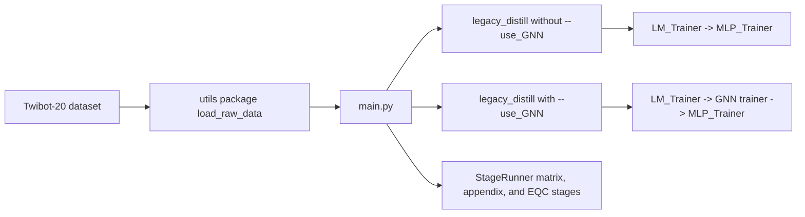

# Architecture - BotDetection Workspace

> High-level workspace map for active code, paper, documentation, and evidence surfaces.

## Workspace Surfaces

| Path | Role |
| --- | --- |
| `LLMbot/` | Active code mainline and nested repository boundary |
| `NLPCC/` | Active NLPCC paper/task line with lightweight manuscript source |
| `docs/` | Workspace protocols, architecture, guides, and durable memory |
| `datasets/` | Dataset metadata and ignored raw data zone |
| `results/` | Ignored generated evidence zone |
| `LMBot/`, `botbr/`, `HyperScan/`, `SEBot/` | Comparison/reference lines |

## System Overview

The active code pipeline inside `LLMbot/` is the root mainline. This runtime
flow describes only `LLMbot/`; `NLPCC/` consumes documented evidence and stores
paper/task source rather than executable training pipeline code.

- Primary entrypoint: `LLMbot/main.py`
- Primary onboarding stage: `--stage legacy_distill`
- Seed control: `--seeds`
- Optional graph path: `--use_GNN`
- Deprecated legacy/reference surfaces: `LLMbot/baseline/` and `LLMbot/code/`
- Detailed active-module ownership is maintained in `LLMbot/docs/ARCHITECTURE.md`.
  Keep this workspace document as the high-level map and update the nested
  `LLMbot/` map for function-level ownership changes.

## Runtime Flow

## Active Mainline Files

| File | Role |
|------|------|
| `LLMbot/main.py` | Parses args, loops over `--seeds`, dispatches legacy or structured stages |
| `LLMbot/parser_args.py` | Source of truth for documented CLI flags and stage names |
| `LLMbot/trainer.py` | Thin compatibility facade for historical imports |
| `LLMbot/stage_runner.py` | Runtime stage orchestration bridge and mixin composition |
| `LLMbot/trainer_distillation.py` | Legacy distillation trainer classes and graph-seed runner |
| `LLMbot/trainer_distillation_metrics.py` | Shared gain/cost budget-curve and paired-bootstrap helpers for distillation/legacy reporting |
| `LLMbot/trainer_indexing.py` | Shared tensor-index normalization and split-safe pseudo-label training-index guards |
| `LLMbot/trainer_legacy_impl.py` | Compatibility fallback for not-yet-extracted legacy stage bodies |
| `LLMbot/model_building.py` | Builds LM, GNN, estimator, semantic, repair, and selector components |
| `LLMbot/LM.py` | Language-model branch used by baseline training |
| `LLMbot/GNNs.py` | Graph backbones including `botrgcn` and `rgcn` |
| `LLMbot/utils/` | Dataset resolution, seed setup, artifact paths, checkpoint loading, and distilled-knowledge loading |

## Mainline Stage Surface

### `legacy_distill`

Default onboarding and reproduction stage.

- Without `--use_GNN`: LM to MLP legacy distillation
- With `--use_GNN`: LM, GNN, and MLP legacy distillation

### Structured follow-on stages

Available through `parser_args.py` and dispatched by `StageRunner`:

- `vertical_minimal`
- `estimator_matrix`
- `semantic_source_matrix`
- `semantic_matrix`
- `repair_matrix`
- `selector_matrix`
- `positioning_matrix`
- `backbone_stress`
- `appendix`
- `eqc_v8_matrix`

These stages remain part of the root mainline surface, but they are not the first-stop onboarding path.

## Research Phase Alignment

Use [research/project_phase_taxonomy.md](research/project_phase_taxonomy.md) for high-level research phase naming. These phase labels do not rename CLI `--stage` values.

| CLI or Work Surface | Research Phase Alignment |
| --- | --- |
| `semantic_source_matrix` | 阶段 A：semantic encoder -> GNN |
| `vertical_minimal`, `estimator_matrix` | 阶段 B：GNN 输出 -> post-hoc estimator |
| `semantic_matrix` | 阶段 C：risk/regime -> local semantic enhancement |
| `repair_matrix` | 阶段 D：risk/regime -> local propagation repair |
| `selector_matrix` | 阶段 E：action selection |
| same-head refinement work | 阶段 F：same-head refinement |
| `positioning_matrix`, `backbone_stress` | 阶段 G：positioning / stress test |

## Historical and Experimental Surface

`LLMbot/baseline/` and `LLMbot/code/` contain legacy/reference implementation lines. Keep them available for migration, deletion planning, archival cleanup, or forensic comparison, but do not route routine onboarding or new implementation there.

## Dataset Expectations

When the active CLI runs from `LLMbot/`, dataset discovery starts from the active loader context and configured dataset paths.

Document commands accordingly so the working directory and dataset lookup behavior stay aligned.
