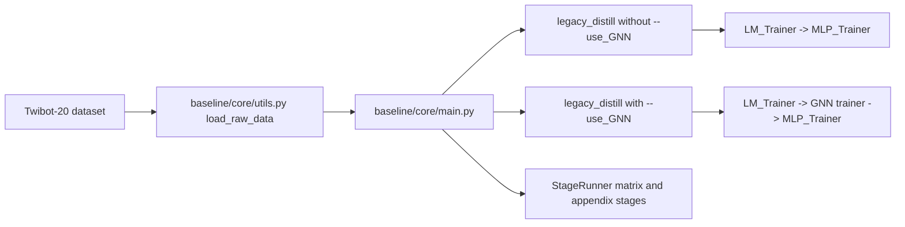

# Architecture - LLMbot Baseline Mainline

> High-level codebase map for the current LLMbot onboarding surface.

## System Overview

The default pipeline inside `LLMbot/` is now the WSDM 2024 baseline line in `LLMbot/baseline/`.

- Primary entrypoint: `LLMbot/baseline/core/main.py`
- Primary onboarding stage: `--stage legacy_distill`
- Seed control: `--seeds`
- Optional graph path: `--use_GNN`
- Historical and experimental surface: `LLMbot/code/`

## Runtime Flow

## Active Mainline Files

| File | Role |
|------|------|
| `LLMbot/baseline/core/main.py` | Parses args, loops over `--seeds`, dispatches legacy or structured stages |
| `LLMbot/baseline/core/parser_args.py` | Source of truth for documented CLI flags and stage names |
| `LLMbot/baseline/core/trainer.py` | Legacy distillation loop plus `StageRunner` for matrix-style stages |
| `LLMbot/baseline/core/model_building.py` | Builds LM, GNN, estimator, semantic, repair, and selector components |
| `LLMbot/baseline/core/LM.py` | Language-model branch used by baseline training |
| `LLMbot/baseline/core/GNNs.py` | Graph backbones including `botrgcn` and `rgcn` |
| `LLMbot/baseline/core/utils.py` | Dataset resolution, seed setup, artifact paths, and distilled-knowledge loading |

## Mainline Stage Surface

### `legacy_distill`

Default onboarding and reproduction stage.

- Without `--use_GNN`: LM to MLP legacy distillation
- With `--use_GNN`: LM, GNN, and MLP legacy distillation

### Structured follow-on stages

Available through `parser_args.py` and dispatched by `StageRunner`:

- `vertical_minimal`
- `estimator_matrix`
- `semantic_source_matrix`
- `semantic_matrix`
- `repair_matrix`
- `selector_matrix`
- `positioning_matrix`
- `backbone_stress`
- `appendix`

These stages remain part of the baseline surface, but they are not the first-stop onboarding path.

## Research Phase Alignment

Use [research/project_phase_taxonomy.md](research/project_phase_taxonomy.md) for high-level research phase naming. These phase labels do not rename CLI `--stage` values.

| CLI or Work Surface | Research Phase Alignment |
| --- | --- |
| `semantic_source_matrix` | 阶段 A：semantic encoder → GNN |
| `vertical_minimal`, `estimator_matrix` | 阶段 B：GNN 输出 → post-hoc estimator |
| `semantic_matrix` | 阶段 C：risk/regime → local semantic enhancement |
| `repair_matrix` | 阶段 D：risk/regime → local propagation repair |
| `selector_matrix` | 阶段 E：action selection |
| same-head refinement work | 阶段 F：same-head refinement |
| `positioning_matrix`, `backbone_stress` | 阶段 G：positioning / stress test |

## Historical and Experimental Surface

`LLMbot/code/` contains the D3F experimental line and related one-off exploration code. Keep it available for historical context and exploratory work, but do not use it as the default onboarding pipeline.

## Dataset Expectations

When the baseline CLI runs from `LLMbot/baseline/core`, dataset discovery checks:

1. `LLMbot/baseline/core/datasets/<dataset>`
2. `LLMbot/baseline/datasets/<dataset>`
3. `LLMbot/datasets/<dataset>`

Document commands accordingly so the working directory and dataset lookup behavior stay aligned.
