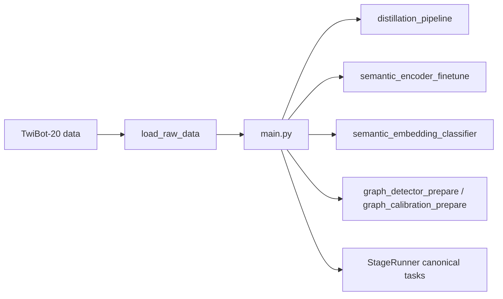

# Architecture - LLMbot Active Mainline

This document describes the current active implementation surface under
`LLMbot/`.

## System Overview

- Active mainline: `LLMbot/`
- Active source directory: `LLMbot/code/`
- Compatibility entrypoints: `LLMbot/main.py`, `LLMbot/precompute.py`,
  `LLMbot/preprocess.py`
- Primary entrypoint implementation: `LLMbot/code/main.py`
- CLI contract source: `LLMbot/code/parser_args.py`
- Stage naming source of truth: `LLMbot/code/stage_registry.py`
- Main execution facade: `LLMbot/code/trainer.py`
- Current large implementation body: `LLMbot/code/trainer_legacy_impl.py`
- Deprecated surfaces: `LLMbot/baseline/`

## Governance Snapshot 2026-07-04

The first governance layer is now documented in `conductor/` and
`UBIQUITOUS_LANGUAGE.md`. Those files are the short first-read context for
future structure, naming, and boundary work; this architecture file remains the
longer implementation map.

Current layer definitions:

- main entry: `LLMbot/main.py` as a compatibility shim into
  `LLMbot/code/main.py`
- CLI contract: `LLMbot/code/parser_args.py`
- orchestration layer: `LLMbot/code/main.py`, `LLMbot/code/stage_runner.py`,
  and `LLMbot/code/stage_registry.py`
- stage owner surfaces: `LLMbot/code/trainer_preparation.py`,
  `LLMbot/code/trainer_semantic.py`, `LLMbot/code/trainer_graph.py`,
  `LLMbot/code/trainer_glance.py`, and
  `LLMbot/code/trainer_distillation.py`
- compatibility facade: `LLMbot/code/trainer.py`
- migration body: `LLMbot/code/trainer_legacy_impl.py`
- algorithm layer: `LLMbot/code/model_building.py`,
  `LLMbot/code/estimators.py`, `LLMbot/code/GNNs.py`,
  `LLMbot/code/operators.py`, `LLMbot/code/hypergnn.py`, and claim packages
  such as `LLMbot/code/conformal_risk_routing/`
- precompute bounded context: `LLMbot/precompute.py` as a compatibility shim
  into `LLMbot/code/precompute.py`
- runner-script surface: root-level `LLMbot/run_*.py` launch scripts
- artifact surface: `LLMbot/experiments/`, `LLMbot/server_logs/`, seed
  `preparation/`, seed `stages/`, queue manifests, logs, and metrics

## NLPCC Submission Package 2026-07-05

`NLPCC/code/` is now a trimmed source-only package for the NLPCC submission
line, not a full mirror of `LLMbot/code/`. It keeps the paper-relevant graph
detector surface in seven flat modules:

- `main.py` as the NLPCC entrypoint
- `parser_args.py` as the canonical CLI contract
- `graph_detector.py` as the graph-detector task boundary
- `router.py` as the reliability router utility surface
- `models.py` as lightweight model/task configuration
- `data_io.py` as JSON/path I/O
- `utils.py` as small shared helpers

This package is intentionally not an artifact store. It must not contain
`experiments/`, `server_logs/`, checkpoints, saved artifacts, model caches, or
binary tensors such as `*.pt`, `*.pkl`, `*.npy`, and `*.safetensors`.

Claim folders, runner folders, GLANCE owner modules, and LLMbot compatibility
orchestration modules are intentionally excluded from `NLPCC/code/`. If NLPCC
needs another function later, add it by first naming the paper-facing interface
and then porting only the minimal implementation required by that interface.

Public interfaces are intentionally small and explicit:

- `parser_args.py` exports `NLPCC_EXPERIMENT_TASKS`, `build_parser`, and
  `parser_args`; it does not accept legacy `--stage` or non-NLPCC tasks.
- `graph_detector.py` exports `build_graph_detector_config`,
  `describe_graph_detector_task`, and `run_graph_detector_task`; the current
  side-effect-free path describes the graph-detector contract rather than
  pretending to run training.
- `router.py` exports only `rank_risk_scores` and `select_top_budget`; router
  variables use `risk_scores` and selected node ids, not GLANCE/refiner names.
- `models.py`, `data_io.py`, and `utils.py` expose only the dataclasses, JSON
  path helpers, and seed parser needed by the seven-module package.

Forbidden vocabulary in `NLPCC/code/` includes `stage`, GLANCE-specific task
names, `trainer_glance`, runner/claim directories, `dry_run`, and generic
unused helpers. Those terms belong to the broader LLMbot research mainline,
not the submission package.

## LLMbot Naming Governance 2026-07-05

`LLMbot/code/` remains the research mainline and still contains multiple claim
families plus historical compatibility names. This governance slice does not
rename business-code symbols in large modules such as `trainer_glance.py`,
`precompute.py`, `estimators.py`, `trainer_preparation.py`, or
`trainer_legacy_impl.py`.

New code and new documentation must choose a claim first, then use that claim
vocabulary together with the common canonical names in
`UBIQUITOUS_LANGUAGE.md`. Legacy names such as `stage`, `GNN_model`,
`LM_model`, `semantic_backbone`, `emb_path`, `node_repr`, and `frozen_g0` are
compatibility terms only. Runner scripts, manifests, existing artifact paths,
and fields such as `stage_dir` are not renamed in this slice.

The claim vocabulary is enforced by `tests/test_llmbot_naming_governance.py`.
That test reads source text and claim README files only; it must not import
heavy ML modules or run training.

## Claim Package Skeleton 2026-07-06

Claim code is now moving toward `LLMbot/code/<claim_name>/` packages. The older
`LLMbot/code/claims/` tree remains a governance-note surface and is not the
business-code destination.

`LLMbot/code/claim_map.json` is the machine-readable classification map. It
records top-level orchestration/shared files, compatibility shims, moved claim
implementations, and function/class-level ownership for files that are still
too large to move safely.

The first low-risk moved implementations are:

- `conformal_risk_routing/router.py`
- `routed_llm_evidence_refinement/llm_evidence_refiner.py`
- `local_graph_repair_diagnostics/trainer_dignn_conflict.py`

The root `router.py`, `llm_evidence_refiner.py`, and
`trainer_dignn_conflict.py` files are compatibility shims so existing flat
imports keep working. Large cross-claim files such as `trainer_glance.py`,
`precompute.py`, `estimators.py`, `trainer_preparation.py`,
`trainer_legacy_impl.py`, `model_building.py`, and `GNNs.py` remain top-level
until their internal symbols have narrower migration slices.

Current source-location structure:

```text
LLMbot/
  main.py, precompute.py, preprocess.py  # compatibility entrypoints
  code/
    main.py, parser_args.py              # main entry implementation + CLI contract
    stage_registry.py, stage_runner.py   # orchestration layer
    trainer_*.py                         # large owner surfaces still top-level
    model_building.py, estimators.py,
    GNNs.py, operators.py, hypergnn.py   # shared/mixed algorithm layer
    router.py                            # compatibility shim
    conformal_risk_routing/
    routed_llm_evidence_refinement/
    local_graph_repair_diagnostics/
    phase_a_foundations/
    high_order_graph_consumption/
    semantic_candidate_correction/
    ablation_positioning_legacy/
    precompute.py, preprocess.py         # independent helper CLIs
    utils/                               # shared helpers
  run_*.py, launch_*.py, *.ps1, *.cmd    # runner scripts, kept outside code/
  experiments/, server_logs/           # artifact surface, read/verify only
```

Do not introduce generic `stages/` or `methods/` directories. Claim packages
are allowed because they match the research-claim governance model. Mixed
large files stay top-level until a narrow owner-transfer slice can move their
symbols safely.

## Refactor Naming Standard 2026-07-04

The flat `LLMbot/code/` migration is followed by naming-first cleanup. New
public commands, docs, manifests, and owner-module code use canonical names:
`experiment_task`, `graph_backbone`, `text_encoder`, `semantic_encoder`,
`embedding_path`, `graph_detector_prepare`, and `fused_x`. Legacy aliases such
as `stage`, `GNN_model`, `LM_model`, `semantic_backbone`, `emb_path`,
`g0_feature_path`, `frozen_g0`, and `node_repr` are compatibility vocabulary
only.

`LLMbot/code/parser_args.py` is the only active module that should create
legacy shadow fields. `LLMbot/code/stage_registry.py` remains the
experiment-task metadata contract. The compatibility class name remains
`StageSpec`, but new orchestration locals should prefer `task_spec`,
`requested_task`, and `execution_task`; `stage_spec` and `execution_stage` are
compatibility aliases. New or moved runner methods must use
`_run_<StageSpec.canonical_name>`. Medium cleanup may remove hidden
deprecated-only compatibility, but not public canonical task names or commonly
used renamed aliases.

Migration order is flat source-location migration first, then naming
governance, then `StageSpec` runtime gate convergence, then trainer owner
transfer, then algorithm consolidation/deletion, and only then runner/artifact
cleanup. This ordering protects CLI compatibility, manifests, and historical
experiment comparability while the migration body is still being reduced.

Current flat-file consolidation status:

- `LLMbot/code/trainer_dignn_conflict.py` now owns both the local
  DIGNN-style conflict stage orchestration and its dual-view refiner core; the
  former single-owner `LLMbot/code/conflict_refiner.py` file was removed.
- `LLMbot/code/model_building.py` now owns `LM_Model`; the former single-owner
  `LLMbot/code/LM.py` file was removed.
- `LLMbot/code/GNNs.py` now owns `RGTLayer` and `SimpleHGNConv`; the former
  single-owner `LLMbot/code/RGT.py` and `LLMbot/code/SimpleHGN.py` files were
  removed.
- `LLMbot/code/trainer_legacy_impl.py` still remains in the inheritance chain
  for matrix/fallback execution, but duplicate contract/path helper definitions
  that were already rebound to `artifact_contracts.py` were removed.
- `LLMbot/code/trainer_distillation.py` is the single owner for the legacy
  distillation pipeline surface: `LM_Trainer`, `GNN_Trainer`, `MLP_Trainer`,
  `_safe_pseudo_label_training_index`, and `run_legacy_graph_seed`.
  `LLMbot/code/trainer_legacy_impl.py` keeps only compatibility aliases for
  those names.

## Current Refactor Snapshot 2026-05-26

- canonical task resolution now lives in `LLMbot/code/stage_registry.py`
- `LLMbot/code/main.py` uses registry-backed task resolution and has a parser-only
  `--help` fast path
- `LLMbot/code/trainer.py` is now a thin compatibility facade over extracted owner
  modules
- `LLMbot/code/artifact_contracts.py` now owns contract/path/provenance helpers
  previously exposed through `stage_helpers.py`
- `LLMbot/code/runtime_env.py` now owns device/CUDA runtime helpers
- `LLMbot/code/trainer_preparation.py` is now the real owner for
  `graph_detector_prepare` and `graph_calibration_prepare`
- `LLMbot/code/trainer_semantic.py` is now the real owner for
  `semantic_encoder_finetune` and `semantic_embedding_classifier`
  - both semantic stages can now switch from canonical labeled supervision to
    routed-node supervision through `--routed_nodes_path`
  - `semantic_encoder_finetune` also supports
    `--semantic_supervision_mode {classifier,answer_token}`; the latter keeps
    the same prompt-sidecar input surface but trains the Qwen PEFT route on
    the final answer token(s) rather than only on a hidden-state classifier
    head
    - for `answer_token`, the consumed prompt must end at the final
      `ASSISTANT_ANSWER:` slot and is tokenized without added special tokens
      before the stage appends the `Yes`/`No` supervision suffix; this keeps
      train-time teacher forcing and eval-time conditional scoring on the same
      prompt surface
  - `semantic_encoder_finetune --semantic_encoder roberta_finetuned` also
    initializes the encoder from the existing SimTeG LM checkpoint
    (`LM_pretrain/best.pkl`) or an explicit
    `--finetuned_roberta_checkpoint_path`
  - `semantic_correction_gate` is also owned by `trainer_semantic.py`; it reads
    frozen base outputs plus existing candidate semantic outputs, builds
    action-wise competence features from base/candidate probabilities,
    confidence, entropy, agreement, and probability deltas, trains a tiny MLP
    accept/defer gate on routed train nodes, locks the accept threshold on
    routed validation nodes, and writes routed-test keep/change artifacts under
    `preparation/semantic_correction_gate`
  - the same stage can switch to
    `--semantic_gate_feature_family node_attribute`, which appends standardized
    target-account attributes from `norm_user_text` and labeled-graph attributes
    from `edge_index.pt` / `edge_type.pt` to every candidate action before gate
    training
  - `--semantic_gate_feature_family local_competence` keeps the probability and
    node-attribute action descriptors, then appends per-candidate local
    competence estimates from top-k routed train neighbors only. The appended
    estimates include local fix/break rates, net utility, candidate correctness,
    base-wrong density, and similarity support. This changes only gate features;
    it does not regenerate prompts, retrain candidate semantic models, or change
    the frozen SimTeG detector.
  - `--semantic_gate_selection_policy defer_softmax` changes the gate head from
    independent candidate accept probabilities to a single
    `{keep_base, accept_candidate_i}` action softmax. `--semantic_gate_safety_policy
    break_first` adds a per-candidate break-risk head whose threshold is selected
    on routed validation nodes. The outputs keep writing the old `gate_prob`
    fields and additionally expose `action_prob` / `break_prob` tensors when
    these policies are enabled.
- `LLMbot/code/trainer_distillation.py` is now the real owner for
  `run_legacy_graph_seed`, `LM_Trainer`, `GNN_Trainer`, and `MLP_Trainer`
- `LLMbot/preprocess.py` is now the standalone support-extension raw-data
  utility for TwiBot-20; it appends support texts and rebuilds the `_new`
  graph artifacts from the official `edge.csv` while keeping the current
  labeled supervision split unchanged
- the active mainline now also has an explicit first-round full-graph graph
  contract behind `--graph_data_variant full_graph_support`; this path keeps
  labeled supervision fixed but runs Phase A GNN propagation and the public
  joint router stage on the `229580`-node graph
- for `neighbor_subgraph` training on `full_graph_support`, the preparation
  runtime now expands labeled targets to full-graph length and aligns
  validation logits by global node id before checkpoint selection. Without this,
  valid/test nodes past the labeled prefix can be scored against shifted labels
  and falsely favor majority-class checkpoints.
- the same first-round full-graph contract now also supports a narrow
  router-only estimator lane through `estimator_ablation`, but only for the
  conformal-style hard-node routers (`posthoc_calibrated_ranker`,
  `calibrated_local_risk_router`,
  `conformal_knn_risk_router`,
  `graph_conformal_set_estimator`, `gnn_2hop_conformal`)
- the same first-round full-graph contract now also supports
  `local_conflict_prune_diag` as a diagnostic-only stage:
  the stage still evaluates only on the labeled prefix, but it now emits
  support-exposure, support-consistency, structural-shock, error-migration,
  regime-shift, and failure-mechanism summaries over the support-augmented
  graph
- `calibrated_local_risk_router` now refers to the stronger v2 local-risk
  ablation: the base posterior stays scalar-only and post-hoc calibrated, then
  a localized 1-hop relation-aware risk object is built from full-graph
  `edge_index` / `edge_type` and optional `node_repr` similarity weights; the
  family-selection step uses `valid_tune` while the conformal threshold stays on
  `valid_cal`
- `conformal_knn_risk_router` is the target-node KNN counterpart: it ranks only
  labeled target centers, treats KNN neighbors as support evidence, can compute
  NCP-style `exp(-distance/lambda_L)` weighted support features, and can use
  KNN calibration neighbors to derive target-specific conformal features.
  HyperScan-aligned runs must use exported `x_new=cat(x_low,x_in)` as the KNN
  construction space; `node_repr` is only a final-hidden legacy/control space
  and should not be used for the HyperScan support flow.
  Its mutual/adaptive/threshold/hubness flags are router-only support filters:
  they do not change classifier logits, train a router head, or consume LLM
  outputs.
- Active graph-consumption positioning is now explicit:
  - simple KNN graph-refine modes are diagnostic controls only
  - mainline high-order graph consumption is the HyperScan-style second-view
    branch with explicit `x_low -> x_new -> x_high -> detector` separation
  - `multiattn` / `multiattn_adaptive` are the preferred detector consumers for
    that branch; residual fusion remains a lightweight control
  - routed-selective HNN consumption is now a separate detector-consumption
    contract on top of the same branch: `x_high` is still constructed from the
    whole sampled subgraph, but `--graph_second_view_consumer_scope routed_only`
    makes only routed/high-risk nodes consume the HNN detector path while
    non-routed rows use an explicit low-order fallback
  - `--graph_second_view_consumer_scope risk_gated_all_nodes` is the continuous
    all-node counterpart for the residual detector line: the full graph still
    computes `x_low -> x_new -> x_high`, but the final residual contribution is
    scaled node-wise as `x_low + alpha * delta`, with `alpha=sigmoid(a*risk+b)`
    from a frozen external `x_new` conformal risk vector
- HyperScan-style dynamic second-view KNN can now consume an offline
  LLM edge-retention cache through
  `--graph_second_view_candidate_policy llm_retain` and
  `--graph_second_view_llm_edge_retain_path`. The cache is produced by
  `precompute.py --prompt_mode llm_knn_edge_retain_v1`, filters non-routed
  KNN support members before the HGNN `x_high` branch, and remains outside the
  router and final bot/human classifier.
- `LLMbot/code/stage_runner.py` now owns the shared `StageRunner` skeleton:
  runtime state, backbone dependency loading, provenance wiring, stage artifact
  helpers, and top-level dispatch
- `LLMbot/code/trainer_legacy_impl.py` still contains graph-aware branches, GLANCE
  branches, and compatibility rebinding for the remaining migration window
- strict GLANCE routing now fits a lightweight auxiliary MLP `Q` to derive the
  router-side soft local homophily signal, augments the router feature set with
  GNN logit-based confidence signals, and now routes through a dedicated
  `LLMbot/code/router.py` module: confidence features are temperature-scaled before
  feature construction, direction-aware social structure features are added for
  TwiBot20, and the learned router scorer is trained as a reliability-first MLP
  over `P(base_wrong | x)` with pairwise ranking support instead of the earlier
  utility-main / reliability-auxiliary contract; the training budget decays
  from 32 to 8, while the public final evaluation now uses a
  validation-selected global budget over whole-split router scores instead of
  fixed batch top-k inference
- strict GLANCE also exposes a train-data regime switch through
  `--joint_train_node_cap`, so the same joint router/refiner pipeline can be
  run either with the paper-style `3000` cap or with the full TwiBot20 train
  split for task-adapted comparisons
- strict GLANCE counterfactual routing keeps `router_score` as the learned
  routing proxy and records `oracle_advantage` separately as the post-hoc
  counterfactual reward trace
- strict GLANCE joint training now also records per-epoch component curves in
  the stage metrics: router diagnostics (`auroc` / `auprc` / score mean) and
  routed-refiner fix/break deltas are tracked separately from the mixed-path
  loss so we can see which side saturates first during training
- the same public `joint_router_refinement` path can now optionally add an
  explicit keep/change gate inside the routed refiner and reweight routed-node
  losses toward base-wrong / oracle-utility-positive samples, so task-specific
  refiner adaptations can be compared without changing the strict router path
- prompt-expert refiners can use the same explicit gate as a keep/change
  mechanism; the gate target can be base-wrong or raw-refiner positive utility,
  and per-node artifacts expose `gate_prob` / `gate_decision` for diagnosis
- for explanation-first prompt-expert `v2/v3`, the canonical evidence path is
  explicitly `router -> routed nodes -> LLM evidence cache -> routed-only
  classifier/refiner`. Selection-embedding/KNN prompt construction remains
  reserved for `prompt_expert_bundle_center_induced_v1` and `mhlgc_llm_guide`;
  it is not part of the routed-only evidence mainline.
- prompt-expert refiners also expose
  `--joint_prompt_expert_fusion` modes including `projector_concat`,
  `mpe_gated`, `gaugllm_selector`, `gaugllm_mope`, `botmoe_selector`,
  `utility_correction_moe`, `metades_selector`,
  `conflict_aware_correction_moe`, raw
  single/triplet experts, `ultratag_propagated_follower_triplet`,
  `raw_concat_metadata_anchor`, and `raw_concat_metadata_only`. The default keeps the projected-concat
  architecture; `mpe_gated` keeps the earlier node-conditioned softmax over
  `graph_following/graph_follower/tweet/conflict/metadata_structured`, while
  `gaugllm_selector` reuses the routed prompt cache plus adjacent explanation
  sidecars at runtime, encodes per-node selector-context texts with the
  finetuned SimTeG RoBERTa line, and applies a strict four-expert
  (`graph_following`, `graph_follower`, `tweet`, `conflict`) dual-attention
  selector before the routed-node classifier. `gaugllm_mope` reuses the same
  sidecar/context path but replaces that custom selector with the official
  GAugLLM `SimilarityAttentionMLP`-style content-plus-context similarity MoPE
  head at default temperature `0.2`. The MoPE path now exposes diagnostic
  temperature and logit-normalization knobs while preserving the official
  formula when `--joint_prompt_expert_mope_logit_norm none`; it also persists
  content/similarity/combined/selector logits for routed-node collapse analysis.
  Lightweight selector calibration can now be added in the same path through
  `--joint_prompt_expert_mope_entropy_weight` and
  the raw-concat family also includes `raw_concat_follower_tweet`, which feeds
  `[z_gnn || graph_follower || tweet || structural_side_channel]` into the same
  routed-node MLP to test whether the current positive follower anchor still
  depends on `conflict`
  ; the raw-concat family also now includes `raw_concat_ego_following` and
  `raw_concat_ego_follower`, plus
  `raw_concat_ego_following_follower`, which feed
  `[z_gnn || ego || graph_following || structural_side_channel]` and
  `[z_gnn || ego || graph_follower || structural_side_channel]`, plus
  `[z_gnn || ego || graph_following || graph_follower ||
  structural_side_channel]` respectively for direct routed-node
  `ego + graph` checks
  `--joint_prompt_expert_mope_load_balance_weight`, both applied only inside the
  routed-node refiner training loop.
  `botmoe_selector` is the implemented sparse BotMoE-style noisy top-k
  selection path over `graph_following`, `graph_follower`, `tweet`, and
  `conflict` only. It does not include `abstain` or `base` as selectable
  experts; the explicit utility gate owns the keep/base versus change/correct
  decision. `metadata_structured` remains a non-selectable structured side
  channel. The selector exposes top-k, noisy-gating, and auxiliary
  load-balancing controls through
  `--joint_prompt_expert_botmoe_top_k`,
  `--joint_prompt_expert_botmoe_noisy_gating`, and
  `--joint_prompt_expert_botmoe_aux_weight`. `utility_correction_moe` is a
  narrower fixed-router correction MoE path: `graph_follower`, `tweet`,
  `conflict`, and `metadata_structured` each have an expert-specific correction
  head, a per-expert utility head predicts positive utility over the frozen base,
  and the maximum utility probability is used as the abstain/keep-change score
  when validation-locked calibration is disabled.
  `--joint_correction_moe_utility_target` selects the utility supervision:
  `loss_advantage` keeps the previous `base_loss - expert_loss - beta > 0`
  target, `decision_gain` uses `base_wrong && expert_pred_correct`, `hybrid`
  accepts either, and `net_gain` keeps fixes positive while treating
  base-correct/expert-wrong actions as explicit negative utility through
  `--joint_correction_moe_break_weight`. `--joint_correction_moe_ranking_weight`
  adds within-node pairwise action ranking over the resulting utility rewards.
  `--joint_correction_moe_gate_calibration {global_threshold,per_action_threshold}`
  fits threshold(s) on validation and locks them for test, so calibration is now
  part of the stage contract rather than only a post-hoc artifact. The stage
  writes raw per-expert logits, losses, advantages, predictions, target/reward
  matrices, calibration metadata, and calibrated per-node decisions into
  `outputs.pt`, `checkpoint.pt`, `metrics.json`, `manifest.json`, and
  `per_node_test.jsonl`. `metades_selector` reuses that correction-selector
  training family but
  changes the action set to `graph_follower`, `tweet`, `conflict`, and a
  runtime-derived `follower_triplet`. Its utility heads additionally consume
  META-DES-style competence meta-features from base/expert confidence, margin,
  entropy, bot probability, disagreement, and probability gap. The
  `follower_triplet` action is built inside the refiner from existing
  `graph_follower + tweet + conflict` projections, so no prompt cache rebuild is
  required. `metadata_structured` remains a side channel, not a selectable
  META-DES action. `conflict_aware_correction_moe` is the BotMoE-inspired
  correction variant for the same fixed routed set: it selects only first-order
  experts (`graph_following`, `graph_follower`, `tweet`) and injects the
  `conflict` embedding plus runtime explanation-context embeddings into each
  action's correction and utility features. This treats `conflict` as a
  cross-view safety/context signal rather than a hard top-1 selectable expert.
  `ultratag_propagated_follower_triplet` is retained only as a legacy
  mean-propagation routed-node ablation: it reuses the existing routed
  prompt-expert cache, performs one-hop mean propagation over cached expert
  embeddings at runtime, and feeds `[z_gnn || ultratag_graph_follower ||
  ultratag_tweet || ultratag_conflict || structural_side_channel]` to the
  no-projector MLP. It is not an UltraTAG-S reproduction. The paper-aligned
  UltraTAG-S adaptation is instead owned by `precompute.py --prompt_mode
  ultratag_s_subgraph_v1`, which generates fresh augmented text for routed test
  nodes or all graph nodes. For routed-node diagnostics, `--graph_data_variant`
  controls the downstream output embedding/edge universe, while
  `--context_graph_variant` can be set to `full_graph_support` so neighbor
  cards are drawn from the full support graph without expanding the evaluated
  target set. Soft-label virtual edges are controlled by
  `--ultratag_virtual_edge_policy`; the current text-only routed diagnostic uses
  `none` and `--ultratag_edge_reconfig false` so graph structure stays on the
  original labeled graph before `graph_detector_prepare`. Router features remain
  unchanged.
- the same strict refiner path can also consume a refiner-only
  `prompt_expert_bundle_v1` payload through `--joint_refiner_embedding_path`:
  `precompute.py` materializes `ego`, `graph_following`, `graph_follower`,
  `tweet`, and `conflict` component tensors plus structural side channels, and
  the routed refiner projects those expert views before applying a lightweight
  following-vs-follower graph gate
- `precompute.py` now also exposes `prompt_expert_bundle_v2`, a versioned
  explanation-first prompt-expert family:
  - `expert_concat_v1 + --prompt_family_version v2` becomes the mainline
    four-expert cache over `graph_following`, `graph_follower`, `tweet`, and
    `conflict`, plus a non-prompt `metadata_structured` expert
  - all four experts run `explanation -> encoder embedding`
  - prompt text is now centralized in `LLMbot/code/prompt.py`, while
    `precompute.py` keeps evidence preparation, fallback text, sidecars,
    encoder execution, and artifact writing
  - the local explain model is loaded once per precompute run and reused across
    all v2 components
  - v2 prompts now use a minimal analytic-template explanation contract:
    `Bot-like Evidence`,
    `Human-like Evidence`,
    `Uncertainty`,
    `View Leaning`,
    `Rationale`, and `Judgement`
  - the same v2/v3 evidence path can optionally switch only the explanation
    prompt framing through `--explain_prompt_style botsay`, reusing BotSay-style
    `Label: bot or human` then `Explanation: ...` wording while keeping the
    existing evidence assembly and no-label-leakage boundary
  - outside the explanation-first v2/v3 path, the older direct prompt experts
    remain available and are now narrower:
    - `expert_ego` uses a BotSay-aligned target-account `tweet + metadata`
      classifier prompt
    - `expert_graph_following` / `expert_graph_follower` use a GLANCE-style
      `EGO + HOP1 + Category? </END>` classifier shell
  - sparse evidence is treated as a limitation, not direct automation proof
  - `--explain_required` makes real LLM-as-explainer runs fail fast when the
    local instruct-model snapshot is missing or generation fails, instead of
    silently writing deterministic fallback explanations
  - explain-model paths resolve offline-first from exact snapshot directories,
    already-cached HF repo ids, or parent directories with exactly one valid
    snapshot child; `LLMbot/models/` itself remains the project Python package,
    not a pretrained snapshot
  - optional wandb monitoring is enabled by `--project_name` and records
    prompt-bundle, per-batch explanation, encoder, and final artifact progress
- `precompute.py` also exposes `prompt_expert_bundle_v3`, the structured
  evidence-card variant of the v2 contract:
  - it keeps the same four explanation-first experts
    (`graph_following`, `graph_follower`, `tweet`, `conflict`) plus
    `metadata_structured`
  - generated text is constrained to source-grounded evidence-card fields such
    as bot-like cues, human-like cues, relation ambiguity, benign explanations,
    coverage, consistency, and source support
  - prompts explicitly forbid final labels, probabilities, confidence scores,
    recommendations, and base-model correction instructions
  - `trainer_glance.py` consumes `semantic_view_mode=prompt_expert_bundle_v3`
    through the same prompt-expert refiner path as v2, including the same
    directional count/presence graph-gate input
  - this is an evidence-augmentation surface for routed-node correction, not a
    representation-repair module and not an LLM-as-predictor path
    for long server-side runs
  - explanation sidecars are written per component and reused by
    `node_id + prompt_hash`, allowing interrupted expert generation to resume
    without recomputing completed rows
  - concat payloads also write component-only `.pt` caches for the selected
    experts, which makes single-expert ablations and failed-component reruns
    cheaper
  - `--explain_batch_size 0` selects a conservative automatic generation batch
    size, using 2 on CUDA and 1 on CPU
  - output filenames become encoder-aware, for example
    `glance_prompt_expert_concat_v2_roberta_finetuned_embed.pt`
  - when `--model_path` is omitted, v2 expert modes encode explanations with
    the SimTeG finetuned RoBERTa alias (`roberta_finetuned`, resolved offline
    to `yzxjb/roberta-finetuned-20`) rather than `roberta-base`
  - if that finetuned source is absent locally, precompute fails fast instead
    of falling back to `roberta-base`
  - when a frozen SimTeG LM checkpoint is available at
    `TwiBot-20_seed_<seed>/checkpoints/LM_pretrain/best.pkl`, v2 loads that
    encoder state after resolving the real finetuned-RoBERTa source; operators
    can pin the source with `--finetuned_roberta_checkpoint_path`
  - that default mirrors frozen SimTeG text consumption: 512-token truncation,
    batch padding, no added special tokens, final hidden-state plain mean
    pooling, and no l2 normalization unless explicitly requested
  - v2 keeps prompt metadata compressed into language-friendly cues, pushes
    exact counts / rates into the refiner side channel, and records a
    schema-named structured metadata expert for BotMoE-style profile evidence
- `precompute.py` also exposes `residual_audit_v1`, a routed-node correction
  prompt-cache surface. It reads frozen SimTeG graph-detector
  prediction/probability outputs as optional prompt context, frames the base
  prediction as either a fallible hypothesis, hidden ablation, or strong-prior
  negative control, and encodes one `residual_audit` prompt component without
  changing router/refiner training or inserting dataset labels. Prompt rows
  store Qwen2.5-Instruct-style `system` / `user` messages and request one
  strict JSON audit object so downstream experiments can separate evidence
  labels from keep/change correction actions.
- `precompute.py` also exposes `dgp_predictor_v1`, a DGP-style routed-node
  predictor prompt-cache surface. It keeps target profile/tweet evidence
  fine-grained, compresses following/follower evidence into ranked coarse
  neighbor cards plus counts, and now uses the same minimal DGP-style
  `Instruct / Query / ASSISTANT_ANSWER: Yes|No` classifier shell as the active
  answer-token route instead of the older JSON-label wrapper.
  The `.pt` cache supports CALM-style query-embedding-MLP experiments; the
  adjacent `*_prompts.jsonl` sidecar can feed
  `semantic_encoder_finetune --semantic_encoder qwen3_peft` through
  `--semantic_text_source_path` for Qwen PEFT predictor tuning. This does not
  alter the graph backbone, router protocol, or joint refiner.
- `precompute.py` also exposes `dgp_predictor_v2`, a norm-text DGP-style
  surface. It uses the target node's `norm_user_text` as fine-grained
  tweet+metadata evidence, summarizes selected neighbor `norm_user_text`
  entries, summarizes the selected relation context, and encodes a final
  Yes/No predictor prompt. The stable mainline is K=5 following-neighbor
  summary; follower-side variants are ablations. This adds generation sidecars
  for `dgp_neighbor_summary` and `dgp_context_summary` but still leaves the
  graph backbone, router protocol, and joint refiner unchanged.
  When this prompt sidecar is consumed by
  `semantic_encoder_finetune --semantic_encoder qwen3_peft
  --semantic_supervision_mode answer_token`, the semantic stage now performs
  answer-token SFT over the final `ASSISTANT_ANSWER:` slot while preserving the
  existing `embeddings.pt` / `outputs.pt` artifact contract.
  Internally, raw `norm_user_text` is first rendered into LLM-friendly
  `PROFILE`, `TWEET_BEHAVIOR`, and `TWEET_SAMPLES` sections, and the payload /
  manifest record this rendering contract through `norm_user_text_rendering`.
  Empty selected-neighbor contexts are handled deterministically, so only
  non-empty relation contexts call the explain model. DGP-v2 summary generation
  is now phrased as a minimal task-agnostic prompt
  (`Summarize ... within 10 tokens`) rather than a long task-aware requirement
  list, and remains constrained to English to prevent copied
  multilingual/noisy source spans from becoming downstream prompt evidence.
  Row-level quality failures after retry are kept as explicit
  `quality_fallback` sidecar rows rather than being treated as normal
  generated summaries.
- `precompute.py` can optionally narrow prompt-expert generation to an explicit
  routed-node subset through `--routed_nodes_path`; only those nodes are
  explained/encoded, but the saved cache is scattered back into full-graph row
  layout with zeros on unselected rows so strict refiner consumption remains
  contract-compatible
  - those routed-targeted payloads now also persist `target_node_ids` and a
    full-graph `target_node_mask`, and `trainer_glance.py` keeps that mask all
    the way through training/evaluation so the refiner cannot spill over onto
    nodes outside the original routed set
- `precompute.py` can now produce a second prompt-expert semantic mode,
  `prompt_expert_bundle_center_induced_v1`, where each center node induces a
  relation-aware support/contrast neighbor evidence subset from `following`
  and `follower` candidates; this still stays on the refiner branch and does
  not modify router features or backbone propagation
- the shared HyperScan-style KNN grouping, routed local hypergraph incidence,
  and relation-overlap proxy helpers are now centralized in
  `LLMbot/code/hypergnn.py` so `precompute.py`, `trainer_preparation.py`, and
  `GNNs.py` no longer maintain separate copies of that logic
- LLM-as-explainer output is therefore injected through prompt-cache tensors and
  `--joint_refiner_embedding_path`; router code does not need adaptation unless
  a later design explicitly makes router features depend on explanation signals
- public `joint_router_refinement` now supports a second routing protocol,
  `frozen_router_reuse`, which reuses a prior router checkpoint/scaler/budget
  so refiner-only evidence upgrades can be evaluated on a fixed routed set
- public `joint_router_refinement` now enforces same-run provenance for strict
  inputs: it must consume the current run's `preparation/graph_detector`
  artifact and uses that artifact's `feature_manifest.path` as the semantic
  tensor source
- public `prompt_expert_quality_audit` is a read-only diagnostic stage for
  existing explanation-first prompt-expert caches. It reads a cache plus a
  reference `joint_router_refinement` stage and writes text-quality,
  view-diversity, base-wrong separability, and per-action utility separability
  artifacts without LLM generation or router/refiner training
- canonical artifact writes now prefer `preparation/` and
  `stages/<canonical_task_name>` namespaces

## Runtime Flow


```mermaid
graph LR
    A["TwiBot-20 data"] --> B["load_raw_data"]
    B --> C["main.py"]
    C --> D["distillation_pipeline"]
    C --> E["semantic_encoder_finetune"]
    C --> E2["semantic_embedding_classifier"]
    C --> F["graph_detector_prepare / graph_calibration_prepare"]
    C --> G["StageRunner canonical tasks"]
```

`main.py` resolves the requested task through `stage_registry.py`, enforces
claim-grade and split gates, loops over `--seeds`, and dispatches either:

- preparation tasks
- the `distillation_pipeline` compatibility path
- or `StageRunner` for canonical post-hoc stages

## Public Task Surface

The current parser-exposed canonical tasks are:

- `distillation_pipeline`
- `semantic_encoder_finetune`
- `semantic_embedding_classifier`
- `graph_detector_prepare`
- `graph_calibration_prepare`
- `local_conformal_diagnostic`
- `local_conflict_prune_diag`
- `local_dignn_conflict_refine_diag`
- `joint_router_refinement`
- `prompt_expert_quality_audit`
- `minimal_pipeline`
- `estimator_ablation`
- `semantic_operator_ablation`
- `semantic_source_ablation`
- `repair_operator_ablation`
- `selector_ablation`
- `positioning_ablation`
- `backbone_stress_test`
- `appendix_ablation`

`--experiment_task` is the public task flag. Hidden `--stage` still parses for
historical commands, but it is no longer the active interface.

## Internal-Only Implemented Branches

The stage registry marks these as internal-only:

- `glance_oracle_refinement_internal`
- `glance_full_graph_refinement_internal`
- `glance_counterfactual_router_internal`
- `glance_budgeted_refinement_internal`
- `glance_refiner_analysis_internal`
- `phase_a_single_cell_internal`

These branches are implemented for controlled diagnostics and internal
comparison paths. They are not part of the public CLI contract.

## Core Modules

| File | Current role |
| --- | --- |
| `LLMbot/main.py` | compatibility entrypoint into `LLMbot/code/main.py` |
| `LLMbot/code/main.py` | parser entrypoint implementation, seed loop, canonical task resolution, split and claim-grade gating |
| `LLMbot/code/parser_args.py` | canonical CLI surface plus hidden legacy aliases |
| `LLMbot/code/stage_registry.py` | canonical task registry, public/internal visibility, legacy-name mapping |
| `LLMbot/code/trainer.py` | thin compatibility facade for historical imports |
| `LLMbot/code/trainer_legacy_impl.py` | large transitional execution body; still owns estimator/matrix, some remaining graph-helper, and compatibility branches |
| `LLMbot/code/stage_runner.py` | shared `StageRunner` skeleton owner during the migration window |
| `LLMbot/code/artifact_contracts.py` | artifact/path/provenance contracts and Phase-A contract symbols |
| `LLMbot/code/runtime_env.py` | device selection and CUDA runtime helpers |
| `LLMbot/code/trainer_preparation.py` | real owner for graph-detector and graph-calibrator preparation |
| `LLMbot/code/trainer_semantic.py` | real owner for semantic finetune execution, cached-embedding direct classification, and semantic metrics helpers |
| `LLMbot/code/trainer_distillation.py` | real owner for legacy distillation trainers and `run_legacy_graph_seed` |
| `LLMbot/preprocess.py` | compatibility entrypoint into `LLMbot/code/preprocess.py` |
| `LLMbot/code/preprocess.py` | standalone support-extension preprocessing utility for `norm_user_text_new.json`, full-graph `edge_new.json`, `edge_index_new.pt`, `edge_type_new.pt`, and `support_idx.pt` |
| `LLMbot/code/trainer_graph.py` | graph owner for shared graph runtime, public local graph diagnostics, structural-conflict RGCN helpers, and `local_conflict_prune_diag` execution |
| `LLMbot/code/trainer_glance.py` | GLANCE owner for shared semantic input wiring, public `joint_router_refinement`, public prompt-expert quality audit diagnostics, migrated internal GLANCE executors, and GLANCE helper tails |
| `LLMbot/precompute.py` | compatibility entrypoint into `LLMbot/code/precompute.py` |
| `LLMbot/code/precompute.py` | prompt-cache builder for legacy GLANCE, relation-aware, versioned prompt-expert, DGP, and MH-LGC-style semantic bundles, including explanation-first `prompt_expert_bundle_v2`, `mhlgc_llm_guide`, optional causal-LM last-hidden semantic embedding, and routed-node-targeted subset precompute with full-graph scatter |
| `LLMbot/code/hypergnn.py` | shared HyperScan-style graph helper module for routed local KNN grouping, relation-overlap proxy augmentation, prompt-side support/contrast neighbor selection, and dynamic hypergraph incidence construction |
| `LLMbot/code/prompt.py` | centralized prompt-builder module for legacy semantic prompts, v2/v3 explanation and evidence-card templates, and MH-LGC-style original-relation plus hypergraph LLM-guide prompts |
| `LLMbot/code/GNNs.py` | graph backbone implementations, `RGTLayer`, `SimpleHGNConv`, HyperScan-style fusion heads, and MH-LGC-style LLM-guided contrastive loss utilities |
| `LLMbot/code/conformal_risk_routing/router.py` | reliability-first router module for temperature scaling, direction-aware social router features, and router MLPs |
| `LLMbot/code/router.py` | compatibility shim for `conformal_risk_routing/router.py` |
| `LLMbot/code/local_graph_repair_diagnostics/trainer_dignn_conflict.py` | local DIGNN-style conflict stage orchestration plus its dual-view refiner core |
| `LLMbot/code/trainer_dignn_conflict.py` | compatibility shim for `local_graph_repair_diagnostics/trainer_dignn_conflict.py` |
| `LLMbot/code/model_building.py` | model builders, `LM_Model`, feature resolution, metadata |
| `LLMbot/code/estimators.py` | uncertainty, conformal, router, and risk estimators |
| `LLMbot/code/operators.py` | local graph/evidence operators |
| `LLMbot/code/utils/` | artifact paths, IO, manifests, metrics, reproducibility helpers |

`LLMbot/code/stage_runner.py` now resolves the active `StageSpec` itself and
rejects stages whose `runner_kind` is not `stage_runner`; preparation,
semantic, legacy-distillation, and Phase-A single-cell stages remain owned by
their narrower entrypoints in `LLMbot/code/main.py`.

## Artifact Layout

New writes use canonical namespaces:

- `seed_<n>/preparation/semantic_encoder`
- `seed_<n>/preparation/semantic_embedding_classifier`
- `seed_<n>/preparation/graph_detector`
- `seed_<n>/preparation/graph_calibrator`
- `seed_<n>/stages/<canonical_task_name>`

For `joint_router_refinement`, the seed-level stage directory now also carries
router-facing analysis artifacts such as:

- `router_performance_summary.json/csv`
- `router_epoch_curve.csv`
- `valid_budget_curve.csv`
- `test_budget_curve.csv`

CSV artifact writers preserve the caller-provided column order and append any
new diagnostic fields found in later rows before writing. This keeps routed
refiner sweeps with target-specific metrics from failing when valid/test rows
carry extra diagnostics not present in the first row.

When `main.py` runs `joint_router_refinement` over multiple seeds in one
command, it also writes experiment-root aggregate summaries:

- `router_seed_summary.json/csv`
- `router_budget_curves_all_seeds.csv`
- `router_epoch_curves_all_seeds.csv`

For `prompt_expert_quality_audit`, the seed-level stage directory writes:

- `manifest.json`
- `metrics.json`
- `quality_gate.json`
- `base_wrong_probe.json`
- `utility_probe.json`
- `audit_inputs.pt`
- `notes.md`

The audit stage is diagnostic only: it reuses existing prompt-expert cache
tensors, adjacent explanation sidecars, and routed-stage outputs, and it does
not regenerate explanations or fit a deployable refiner.

Compatibility reads still accept legacy locations such as:

- `seed_<n>/stages/semantic_finetune`
- `seed_<n>/frozen/g0`
- `seed_<n>/frozen/gates/gats`

The active rule is write canonical, read canonical-first with legacy fallback.

## Full-Graph First Round

The current full-graph rollout is intentionally narrow:

- supported tasks:
  - `graph_detector_prepare`
  - `estimator_ablation` (conformal-style router modes only)
  - `joint_router_refinement`
- graph source:
  - `edge_index_new.pt`
  - `edge_type_new.pt`
- optional Phase-A graph-only refinement:
  - `--graph_refine_mode hyperscan_knn_hypergraph_proxy_augment` adds one
    feature-KNN relation before GNN training by expanding each HyperScan-style
    local KNN group into bidirectional center-neighbor proxy edges
  - `--graph_refine_mode relation_overlap_knn_proxy_augment` keeps the same
    proxy-edge output contract but restricts semantic grouping to
    relation-supported 1-hop neighbors, optionally centered on
    `--routed_nodes_path`
  - `--graph_refine_mode relation_overlap_knn_repr_prefit_augment` keeps that
    same local overlap proxy contract but first trains a relation-view GNN on
    the original graph and uses `node_repr + g0_input` as the similarity space
    for routed-node local KNN grouping
  - `--graph_second_view_scope routed_nodes` is the canonical active-mainline
    path that moves the similarity grouping back into model forward:
    it uses `--graph_backbone rgcn_hyperscan`, keeps the original relation graph
    unchanged, constructs routed-node local KNN hyperedges from `x_low + x_in`
    each forward, then runs a separate second-view branch before fusing back
    into the relation-view node representation
    `graph_detector_prepare` now also writes the true `x_low` and `x_new`
    tensors into frozen `outputs.pt` for these HyperScan-style backbones, so
    downstream router stages can reuse the exact second-view KNN space instead
    of approximating it from `node_repr`
    `node_repr` is therefore not a valid construction-space substitute for this
    flow; keep it only for explicitly labeled final-hidden control ablations.
    The model-side dynamic branch now fails fast if its second-view
    `feature_source` metadata names final `node_repr`, because the branch
    constructs hyperedges from the forward-native `x_new` tensor.
    Routed second-view support-policy ablations are split across modules:
    `trainer_preparation.py` builds candidate rows and label-free role tags
    (`hard_routed`, `stable_nonrouted`, `stable_counterfactual`) from routed
    nodes, risk vectors, and base predictions, while `hypergnn.py` applies the
    quota-aware top-k policy inside each forward over the current `x_new`
    geometry.
  - `rgcn_h2fag_dualspace_hyperscan*` adds a stricter dual-space contract on
    top of that family:
    - `--graph_construct_embedding_path` or construct-side nodeinput features
      define the only graph-branch input
    - the rewritten `construct_complete_v2` branch is
      `x_in_construct -> x_low_construct -> x_new_construct -> x_high_construct`
    - dynamic second-view KNN / hypergraph construction is built directly from
      `x_new_construct = cat(x_low_construct, x_in_construct)`
    - for `*_nodeinput`, `graph_node_input_family=hyperscan_meta_tweet_proxy`
      is scoped to construct-side nodeinput preprocessing that produces
      `x_in_construct`
    - final detector fusion still happens only in `fused_x`, but both `x_low`
      and `x_high` now come from the same construct graph branch
    - old dual-space artifacts without
      `backbone_contract_version=construct_complete_v2` are pre-rewrite and not
      comparable to the rewritten family
    - v1 explicitly excludes routed multiview refinement, routed high-pass, and
      MH-LGC repair/contrast overlays so the dual-space family stays a clean
      detector-consumption comparison line
  - `--graph_second_view_scope labeled_prefix` uses the same dynamic second
    view over labeled-prefix centers instead of an explicit routed-node file
  - `--graph_second_view_scope neighborloader_batch` keeps the sampled-subgraph
    geometry of the released HyperScan-style training path: seed nodes come
    from `NeighborLoader`, and KNN hyperedges are rebuilt inside each sampled
    subgraph from forward-native `x_new`. Its diagnostic hard-member filtering
    maps `--graph_second_view_candidate_routed_nodes_path` onto the sampled
    `batch.node_id` rows and applies `exclude_routed` or
    `post_topk_exclude_routed` without changing the batch seeds or replacing
    the batch-local KNN construction. `--graph_neighborloader_contract` now
    makes the supervision/evaluation contract explicit: `seed_only` preserves
    the active-mainline seed-row metric path, while
    `hyperscan_sampled_subgraph` switches train/valid/test to the full sampled
    subgraph rows with repeated-node counting and validation-accuracy checkpoint
    selection, while `outputs.pt` remains a deduplicated full-graph export.
    The same path now also supports routed-selective detector consumption:
    `graph_second_view_consumer_scope=routed_only` keeps KNN membership/global
    construction unchanged but mixes detector outputs row-wise with
    `batch.node_id`-mapped routed masks. This is a detector-consumption change,
    not a router change and not a member-policy change. Under
    `graph_second_view_fusion=residual`, non-consumer rows explicitly fall back
    to the low-order detector path.
    `graph_second_view_consumer_scope=risk_gated_all_nodes` instead keeps
    all-node consumption but reads a full-graph frozen risk payload from
    `graph_second_view_risk_path`, maps it onto sampled rows through
    `batch.node_id`, and writes both the realized gate and the aligned risk back
    into the deduplicated full-graph `outputs.pt`.
  - `--graph_second_view_hypergraph_backend {pyg,dhg}` chooses PyG
    `HypergraphConv` or DHG `HGNNConv` over the same dynamic incidence
    specification. `--graph_second_view_use_bn` additionally enables DHG-side
    batch normalization for closer alignment to the released HyperScan
    TwiBot20 contract, while `--graph_second_view_fusion
    {residual,multiattn,multiattn_adaptive,construct_acm}` chooses the fusion head
    independently
  - `multiattn` is the HyperScan-faithful two-channel detector family in this
    codebase: `x_low` from the relation branch and `x_high` from the HGNN
    branch are consumed by the bidirectional cross-attention detector without a
    separate identity channel.
  - `multiattn_adaptive` keeps the HyperScan-style bidirectional
    cross-attention detector tokens and applies a node-wise FAGCN-style
    low/high adaptive mix before the final classifier. This is a bounded
  - `construct_acm` is the construct-complete detector consumer that mixes
    `x_in_construct`, `x_low_construct`, and `x_high_construct` with a
    node-wise identity/low/high gate. It is a dual-space three-channel
    extension, not the faithful HyperScan baseline.
    detector-fusion migration, not a full spectral FAGCN backbone.
  - `--mhlgc_enable` is an optional legacy graph-detector training loss, not a
    graph rewrite mode: it consumes a graph-node-aligned LLM-guide embedding
    tensor from routed-node `precompute.py --prompt_mode mhlgc_llm_guide
    --routed_nodes_path ...`, selects borderline positive-label anchors, and
    adds an LLM-guided hard-negative contrastive term from `LLMbot/code/GNNs.py`
  - this legacy/diagnostic branch distinguishes five MH-LGC contrast spaces:
    input semantic space (`semantic`), HyperScan construction space (`x_new`),
    HyperScan pre-detector view-pair space (`low_high_concat` / `low_high`),
    explicit final detector hidden space (`fused_x`), and the legacy alias for
    that same final hidden (`node_repr`)
  - routed prompt-cache targets can now be consumed as an explicit anchor mask
    through `--mhlgc_anchor_source routed_target_mask`, rather than only
    through the historical nonzero semantic-cache heuristic
  - when `--mhlgc_anchor_source routed_target_mask` is active, the same
    routed-node `mhlgc_llm_guide` payload also carries explicit
    `following_view`, `follower_view`, `mutual_view`, and `semantic_knn_view`
    rows. `trainer_preparation.py` passes those full-graph aligned rows into
    `GNNs.py`, where a routed-only `RoutedMultiViewTransformer` refines only
    nodes that were explicitly routed and have non-empty auxiliary context
  - `--mhlgc_pair_mode repair_aware` is the legacy repair-aware variant:
    it keeps the supervised classifier path unchanged, injects the routed
    guide into the HyperScan second-view construction path (`x_new ->
    dynamic hypergraph -> x_high`) for HyperScan-style backbones, and then
    contrasts the original graph representation against that repaired view in
    the selected contrast space
  - the routed multiview refiner consumes detector-space tokens, not raw prompt
    strings. If the semantic guide cache dimension differs from detector
    `hidden_dim`, `trainer_preparation.py` records the cache width and
    `GNNs.py` learns a narrow semantic-token projector before the bidirectional
    MultiAttn / Transformer block. Under the `multiattn` detector head, the
    auxiliary relation/hypergraph view tokens are also projected into the same
    detector space before stacking, so routed multiview refinement stays
    dimension-safe when `fused_x` is wider than `x_low/x_high`
  - `--mhlgc_hyperedge_mask_probability` extends the augmented branch from
    feature/edge masking to incidence masking on the active second-view
    hypergraph while preserving the current two-view cross-attention detector;
    only the auxiliary augmented forward pass is perturbed
  - `--mhlgc_anchors_per_batch 1 --mhlgc_negative_count 3` is the
    paper-aligned batch setting for the adapted TwiBot20 run. It keeps one
    borderline positive-label anchor and chooses three hard negative-label
    nodes per batch; leaving `--mhlgc_negative_count 0` keeps the earlier
    all-negative exploratory setting.
  - `--routed_contrast_family` is a separate graph-detector ablation namespace
    and is not part of the legacy MH-LGC path:
    - it keeps the HyperScan-style detector forward contract unchanged
    - it is full-batch only and applies only to routed **train** nodes from
      `--routed_nodes_path`
    - `low_high` aligns same-node `x_low` and `x_high`
    - `three_view_control` adds a stop-grad frozen semantic teacher aligned
      only to `x_low`
    - `supcon_class` is a BotSCL-style same-class positive /
      different-class negative control over `fused_x`
    - `hybrid` combines the low/high same-node loss with the class-aware
      supervised contrast control
    - `--routed_contrast_gate heuristic_reliable` is the current support
      reliability filter; it reuses routed multiview support rows already
      serialized in `mhlgc_llm_guide` payloads and does not introduce an
      additional router or predictor
  - `--routed_highpass_mode` is the routed-only heterophily-aware correction
    branch inspired by H2GCN/FAGCN/BotSCL-style separation:
    - `--routed_highpass_target logits` runs after the detector fusion head in
      `fused_x` space and preserves the legacy delta-logit correction path
    - `--routed_highpass_target x_high` applies the same self/low/high routed
      correction to the HGNN high-order branch before HyperScan-style
      cross-attention
    - it builds `h_self`, relation-neighbor `h_low`, and residual `h_high`
      channels only for the fixed routed-node mask from `--routed_nodes_path`
    - training is staged: the base detector is selected with standard CE, then
      frozen while only the routed high-pass correction module is optimized
    - `adaptive` learns a self/low/high gate; `low_only` and `high_only` are
      ablations over the same candidate construction
    - default candidates are relation-supported 1-hop neighbors; the
      `relation_1hop_plus_xnew_knn` ablation adds forward-native `x_new` KNN
      candidates to test whether semantic-neighbor support helps routed nodes;
      `x_new` remains the construction/candidate space
    - non-routed train nodes are preserved with a KL term against base logits
    - optional `--routed_highpass_risk_path` supervises correction utility and
      high-pass gating, not bot probability
    - labeled-labeled neighbor pairs provide edge-role supervision:
      same-label edges prefer low-pass, different-label edges prefer high-pass
    - it is mutually exclusive with `--mhlgc_enable` and
      `--routed_contrast_family` so a run isolates one correction mechanism
  - the MH-LGC prompt cache can now encode flattened original-relation plus
    hypergraph views through a causal LLM by passing
    `--embedding_model_class causal_lm --embedding_pooling_mode
    causal_last_hidden_last_token`; `precompute.py` then pools
    `outputs.hidden_states[-1]` at the last valid token and records
    `embedding_encoder_contract=causal_lm_last_hidden_state_last_token_embedding`
  - this branch is kept for comparison and mechanism diagnosis. It is not the
    canonical routed-only evidence/classifier mainline, even though the DHG
    and MultiAttn realization axes are parser-selectable
- supervision source:
  - unchanged `labels.pt`
  - unchanged `train_idx.pt/valid_idx.pt/test_idx.pt`
- semantic source:
  - labeled RoBERTa embeddings from `--embedding_path`
  - support RoBERTa embeddings from `--support_embedding_path`
  - concatenated at runtime rather than written as a new tracked feature file

This means graph-wide tensors and router features now use `graph_node_count`,
while evaluation and all supervised losses remain bounded to the labeled node
prefix.

## Maintainability Hotspots

Current structural pressure points:

- `LLMbot/code/trainer_legacy_impl.py` still concentrates too many responsibilities
- `LLMbot/code/estimators.py` remains large and multi-purpose
- the new `LLMbot/code/router.py` extraction reduces strict-router churn inside
  `LLMbot/code/trainer_legacy_impl.py`, but stage orchestration and artifact
  writing still live there
- GLANCE runner/helper tails have moved to `LLMbot/code/trainer_glance.py`,
  and `local_conflict_prune_diag` has moved to `LLMbot/code/trainer_graph.py`;
  `LLMbot/code/trainer_legacy_impl.py` still holds estimator/matrix,
  compatibility blocks, and some remaining graph helper paths
- `LLMbot/code/trainer_legacy_impl.py` still retains historical duplicate blocks for
  preparation and semantic paths even though runtime ownership has moved
- some runtime-only helper artifacts still rely on compatibility naming and are
  still in migration/transition

The immediate objective is to keep the public contract canonical even while the
implementation continues to be extracted from `LLMbot/code/trainer_legacy_impl.py`.

## Structural Reality Check 2026-05-26

The split is now real at the first owner-transfer layer:

- `artifact_contracts.py` and `runtime_env.py` replaced `stage_helpers.py`
- `trainer_preparation.py` owns preparation execution
- `trainer_semantic.py` owns semantic finetune execution
- `trainer_distillation.py` owns the legacy distillation trainers
- `trainer_graph.py` owns shared graph runtime wiring and public graph
  diagnostic executors
- `trainer_glance.py` owns shared GLANCE semantic input wiring, public
  `joint_router_refinement`, and migrated internal GLANCE executors

What is still not finished:

- `trainer_legacy_impl.py` remains the dominant execution body because
  estimator/matrix, local conformal helper tails, and some duplicate legacy
  blocks are still there
- some compatibility rebinding remains inside `trainer_legacy_impl.py` while
  callers are migrated
- `trainer_graph.py` now owns the structural-conflict RGCN helper, the
  non-full-graph and full-graph structural-view paths, the conflict router, and
  `local_conflict_prune_diag`; it no longer uses the legacy body for this
  diagnostic fallback

Interpretation:

- public contract and first-layer owner migration are in place
- the next architectural phase is estimator/matrix boundary cleanup, local
  conformal helper transfer, and runtime-only artifact namespace cleanup

## Next Extraction Order

1. Compatibility tail cleanup:
   retire duplicate legacy blocks inside `trainer_legacy_impl.py` once the new
   owners are directly used everywhere.
2. Estimator/matrix boundary cleanup:
   separate estimator algorithm variants from matrix runner compatibility
   paths in `estimators.py`, `model_building.py`, and `router.py`.
3. Local conformal helper cleanup:
   move the remaining local conformal router helper tails out of
   `trainer_legacy_impl.py` only after a narrow reference scan.

## Documentation Sync Rule

When runtime flow, module boundaries, stage ownership, or extraction status
changes, update this file in the same task together with:

- `LLMbot/README.md`
- `docs/code/research.md`
- `code.md` when the maintainability-risk picture changes

## Research Phase Alignment

Use [project_phase_taxonomy.md](G:\Research\BotDetection\docs\research\project_phase_taxonomy.md)
for the high-level A-G research vocabulary. Those phase labels do not rename
CLI task names; they are planning language above the active code contract.
