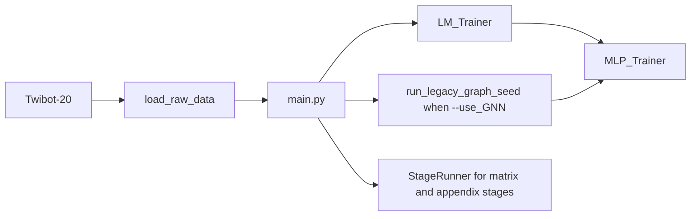

# Model Guide - LLMbot Baseline Mainline

Updated: 2026-04-23
Scope: current default pipeline in `LLMbot/baseline/core`

## Overview

The current default model story in the `LLMbot/` tree is the baseline pipeline in `baseline/core`.

- `main.py` parses `--stage` and iterates over `--seeds`.
- `legacy_distill` is the default onboarding and reproduction stage.
- `--use_GNN` switches the legacy path from LM -> MLP distillation to LM + GNN + MLP distillation.
- `LLMbot/code/` remains historical and experimental rather than the default model surface.



## Mainline Modules

### `baseline/core/parser_args.py`

Defines the baseline CLI contract.

Key onboarding flags:
- `--stage legacy_distill`
- `--dataset Twibot-20`
- `--seeds 1` or `--seeds 1,2,3`
- `--use_GNN`
- `--GNN_model botrgcn|rgcn|rgt|hgt|simplehgn|gatv2`

### `baseline/core/main.py`

Controls the execution flow.

- Resolves the device
- Forces `--use_GNN` for non-legacy matrix stages
- Loads data through `load_raw_data(...)`
- Iterates over every seed from `--seeds`
- Dispatches to legacy distillation or `StageRunner`

### `baseline/core/trainer.py`

Implements the training surfaces.

- `run_legacy_graph_seed(...)` handles the graph-backed legacy path
- `LM_Trainer` handles the text branch
- `MLP_Trainer` handles the distilled classifier branch
- `StageRunner` covers structured estimator, semantic, repair, selector, backbone-stress, and appendix stages

## Recommended Commands

Run from `LLMbot/baseline/core`.

```bash
# Legacy distillation without GNN
python main.py \
  --stage legacy_distill \
  --dataset Twibot-20 \
  --seeds 1

# Legacy distillation with GNN
python main.py \
  --stage legacy_distill \
  --dataset Twibot-20 \
  --use_GNN \
  --GNN_model botrgcn \
  --seeds 1,2,3
```

## Dataset Resolution

From `baseline/core`, the loader checks these locations in order:

1. `./datasets/<dataset>`
2. `../datasets/<dataset>`
3. `LLMbot/datasets/<dataset>`

Keep that working-directory assumption in docs and onboarding material.

## Historical Surface

`LLMbot/code/` is preserved for the D3F experimental line, exploratory scripts, and historical reference. It is no longer the default model guide entrypoint.
