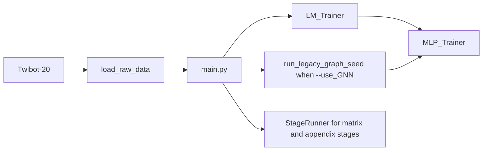

# Model Guide - LLMbot Root Mainline

Updated: 2026-05-14
Scope: current default pipeline in `LLMbot/`

## Overview

The current default model story in the `LLMbot/` tree is the root mainline pipeline.

- `main.py` parses `--stage` and iterates over `--seeds`.
- `legacy_distill` is the default onboarding and reproduction stage.
- `--use_GNN` switches the legacy path from LM -> MLP distillation to LM + GNN + MLP distillation.
- `LLMbot/baseline/` and `LLMbot/code/` are deprecated legacy/reference surfaces rather than the default model surface.



## Mainline Modules

### `parser_args.py`

Defines the active CLI contract.

Key onboarding flags:
- `--stage legacy_distill`
- `--dataset Twibot-20`
- `--seeds 1` or `--seeds 1,2,3`
- `--use_GNN`
- `--GNN_model botrgcn|rgcn|rgt|hgt|simplehgn|gatv2`

### `main.py`

Controls the execution flow.

- Resolves the device
- Forces `--use_GNN` for non-legacy matrix stages
- Loads data through `load_raw_data(...)`
- Iterates over every seed from `--seeds`
- Dispatches to legacy distillation or `StageRunner`

### `trainer.py`

Implements the training surfaces.

- `run_legacy_graph_seed(...)` handles the graph-backed legacy path
- `LM_Trainer` handles the text branch
- `MLP_Trainer` handles the distilled classifier branch
- `StageRunner` covers structured estimator, semantic, repair, selector, backbone-stress, appendix, and EQC v8 stages

## Recommended Commands

Run from `LLMbot/`.

```bash
# Legacy distillation without GNN
python main.py \
  --stage legacy_distill \
  --dataset Twibot-20 \
  --seeds 1

# Legacy distillation with GNN
python main.py \
  --stage legacy_distill \
  --dataset Twibot-20 \
  --use_GNN \
  --GNN_model botrgcn \
  --seeds 1,2,3
```

## Dataset Resolution

From `LLMbot/`, the loader starts from the active mainline context and configured dataset paths.

Document commands with that working-directory assumption so dataset lookup behavior stays aligned.

## Historical Surface

`LLMbot/baseline/` and `LLMbot/code/` are preserved for legacy/reference context until deletion. They are no longer the default model guide entrypoint.
