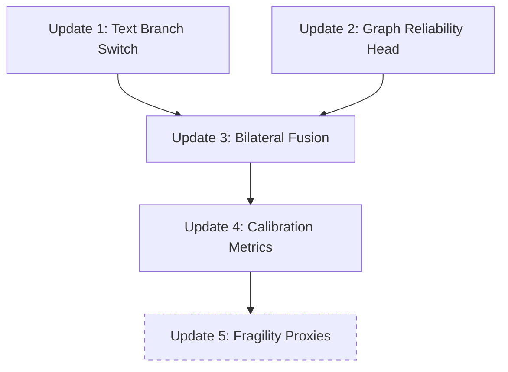

# Update Requirements Document

> **Source**: Reviewer feedback on RACE-Bot-D3F codebase
> **Priority**: Critical — blocks paper submission
> **Scope**: `model.py`, `train.py`, `main.py`, `utils.py`
> **Last Audit**: 2026-03-18 — All P0/P1 items completed

---

## Update 1: Replace Text Branch in Main Training Path

**Priority**: 🔴 P0 — Must fix
**Status**: ✅ DONE (2026-03-17)
**Files**: `model.py`, `train.py`, `main.py`

### Problem

`RACEBotD3F` uses `TextCandidateEvidence` (multi-layer routing) as its text branch, but the paper's stated contribution is a "final-layer calibrated text head with decoupled uncertainty". The correct implementation `TextFinalSemanticHead` already exists in `model.py` (lines 77–143) but is not wired into the training path.

Additionally, `layer_ids=['22','28','34','final']` in `main.py` does not match `layer_prior={'22':0.70,'30':0.73,'36':0.76}` in `train.py`, and `getattr(batch, f'q{l}')` for `l='final'` produces `batch.qfinal` instead of `batch.q_final`.

### Required Changes

#### model.py
- `RACEBotD3F.__init__`: Replace `TextCandidateEvidence` with `TextFinalSemanticHead`
- `RACEBotD3F.forward`: Change multi-layer `q_dict` assembly to single `batch.q_final[:bsz]` call; replace `u_route` with `u_text`
- Remove `layer_ids` parameter from `RACEBotD3F.__init__`

#### train.py
- Delete `self.layer_prior` dictionary entirely
- Change `self.model(batch, self.layer_prior, self.cfg['text'])` → `self.model(batch, self.cfg['text'])`

#### main.py
- Remove `--q22_path`, `--q28_path`, `--q34_path` CLI arguments
- Keep only `--q_final_path`
- Simplify `Data(...)` constructor: remove `q22=`, `q28=`, `q34=` attributes
- Remove `layer_ids` from `RACEBotD3F(...)` init
- `MiniBatch` dataclass: remove `q22`, `q28`, `q34` fields

### Acceptance Criteria
- Model trains with only a single `q_final` embedding file
- `TextFinalSemanticHead` is the sole text branch
- No `layer_prior` anywhere in the training path

### Implementation Summary
- `RACEBotD3F.__init__` uses `TextFinalSemanticHead` (`model.py:249`)
- `forward` calls `batch.q_final[:bsz]` only (`model.py:265`)
- `MiniBatch` has no `q22/q28/q34` fields (`train.py:24-32`)
- `main.py` only accepts `--q_final_path`, no multi-layer args
- `layer_prior` completely removed from all files

---

## Update 2: Add Graph-Side Structural Reliability Head

**Priority**: 🟡 P1 — Required for "reliability-aware" claim
**Status**: ✅ DONE (2026-03-17, enhanced beyond original spec)
**Files**: `model.py`, `utils.py`

### Problem

The graph branch (`GraphEvidenceEncoder`) is a plain RGCN evidence head with no structural reliability signals. The paper claims "node-wise conditional modality reliability" but the graph side contributes nothing toward this.

### Required Changes

#### model.py
- Add a new `GraphReliabilityHead` module that takes pre-computed structural features:
  - `log_degree` — normalized log-degree
  - `feature_homophily` — cosine similarity with neighbors (already in `utils.py: compute_feature_homophily`)
  - `graph_missing_flag` — binary flag for nodes with no edges
- Output: `r_graph ∈ [0,1]` (scalar reliability score per node)
- Wire `r_graph` into `D3FFusion` temperature computation alongside text-side uncertainty

> [!NOTE]
> `compute_feature_homophily()` already exists in `utils.py` and can be reused directly.

### Implementation Summary
- `GraphReliabilityHead` added at `model.py:144-161`
- Input expanded to 5-dim (reviewer feedback): `[in_log_deg, out_log_deg, total_log_deg, neighbor_deg_var, graph_missing]`
- Direction-aware degrees (in/out/total) eliminate directional bias
- `neighbor_deg_var` is pure topology (neighbor degree variance), replacing `sym_homophily` which was text-contaminated
- `graph_missing` based on total degree (in+out==0), not just in-degree
- Wired into `RACEBotD3F.forward` via `batch.struct_feats` (`model.py:275`)

---

## Update 3: Make Fusion Reliability-Aware on Both Sides

**Priority**: 🟡 P1 — Required for "reliability-aware" claim
**Status**: ✅ DONE (2026-03-17, enhanced: r_graph gates trust+evidence, not just T)
**Files**: `model.py`

### Problem

`D3FFusion` temperature depends only on text-side `u_route`. There is no graph-side reliability input, making the fusion "single-sided reliability".

### Required Changes

#### model.py — `D3FFusion`
- Add `r_graph` as input to `forward()` alongside `u_text`
- Modify temperature formula: `T = 1 + τ · σ(a₁·conflict + a₂·u_text + a₃·r_graph + b)`
  - Add learnable parameter `a3`
- Replace `u_route` parameter name with `u_text` everywhere

### Implementation Summary
- `D3FFusion.forward` accepts `(alpha_t, alpha_g, u_text, r_graph)` (`model.py:184`)
- **Beyond original spec**: `r_graph` directly gates `trust_g` and `e_g_d` (reviewer's core fix):
  - `trust_g = r_graph * (1-u_g) * p_g` (`model.py:213`)
  - `e_g_d = r_graph * (1-0.5*rho) * e_g` (`model.py:209`)
- Temperature T is residual smoothing only: `T = 1 + τ·σ(a₁c + a₂u_text + a₃(1-r_graph) + b)` (`model.py:224`)
- `u_route` fully replaced by `u_text`

---

## Update 4: Add Calibration-First Evaluation Metrics

**Priority**: 🟡 P1 — Required for reliability paper
**Status**: ✅ DONE (2026-03-17, enhanced with post-hoc calibration + composite checkpoint)
**Files**: `utils.py`, `train.py`

### Problem

`evaluate()` only reports F1 and Accuracy. A reliability paper requires: ECE, Brier, NLL, AURC, risk-coverage.

### Required Changes

#### utils.py
- Add function `compute_ece(probs, labels, n_bins=15) → float`
- Add function `compute_brier(probs, labels) → float`
- Add function `compute_nll(probs, labels) → float`
- Add function `compute_aurc(probs, labels) → float`

#### train.py — `evaluate()`
- Collect per-sample `probs` and `labels`
- Call calibration utilities
- Report: `{f1, acc, ece, brier, nll, aurc}`
- Log to WandB

### Implementation Summary
- `compute_ece`, `compute_brier`, `compute_nll`, `compute_aurc` all in `utils.py`
- `evaluate()` reports `{f1, acc, ece, brier, nll, aurc}` (`train.py:254-268`)
- WandB logging for all metrics (`train.py:420-425`)
- **Beyond original spec**:
  - Composite checkpoint score: `F1 - 0.05*ECE - 0.05*AURC` (`train.py:398-408`)
  - Best checkpoint reload before test (`train.py:447-451`)
  - Post-hoc temperature calibration via LBFGS on validation set (`train.py:303-322`)
  - Calibrated test evaluation (`train.py:324-394`)
  - Per-node diagnostic dump to JSONL (`train.py:230-281`)

---

## Update 5 (Deferred): Integrate Per-Node Fragility Proxies

**Priority**: ⚪ P2 — Strengthens paper but not blocking
**Status**: ⚪ NOT STARTED (Deferred per original spec)
**Files**: `main.py`, `train.py`

### Problem

`precompute.py` saves `per_node_fragility_proxies.pt` but `main.py` never loads it.

### Note

This is **deferred** — the immediate priority (Updates 1–4) already makes the code consistent with the paper claim. Integrating fragility proxies can be a follow-up contribution.

---

## Dependency Order

---

## Compatibility Notes

| Concern | Resolution |
|---------|------------|
| `precompute.py` still generates multi-layer embeddings | ✅ Unchanged — used for Stage 1 analysis only |
| `GNNs.py` / `RGT.py` | ✅ Unchanged — graph encoder backbone unaffected |
| Saved `q22/q28/q34.pt` files | ✅ Still valid for Stage 1 analysis; just not needed for training |
| WandB logging | ✅ Extended with calibration metrics |
| `TextCandidateEvidence` class | ✅ Kept in `model.py` for ablation; just not wired into `RACEBotD3F` |

---

## Additional Enhancements (Beyond Original Spec)

These were driven by reviewer feedback and are already implemented:

| Enhancement | File | Description |
|-------------|------|-------------|
| GraphEvidenceEncoder strengthened | `model.py:117-140` | LayerNorm + residual + configurable `num_relations`/`dropout` |
| 5-dim directed structural features | `utils.py:50-110` | in/out/total degree + neighbor_deg_var (pure topology) + graph_missing |
| r_graph gates trust + evidence | `model.py:209,213` | Core reviewer fix: reliability-aware routing, not just smoothing |
| Post-hoc temperature calibration | `train.py:303-322` | LBFGS on validation set after training |
| Composite checkpoint score | `train.py:398-408` | `F1 - 0.05*ECE - 0.05*AURC` |
| Per-node diagnostic dump | `train.py:230-281` | JSONL with all intermediate values for analysis |
