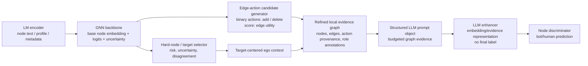

# Refined Local Evidence Graph Method

Date: 2026-05-16

Status: first-round method specification. This document defines the research boundary and migration plan for the next implementation/design pass. It does not report experimental results.

## 1. Research Boundary

The current mainline is:

```text
LM -> GNN -> refined local evidence graph -> LLM enhancer -> embedding/evidence representation -> node discriminator
```

The method is a local, budgeted evidence-refinement pipeline for social bot detection. It should not be written as a direct reproduction of GAugLLM, a direct LLM prediction system, or a general graph structure learning method.

| Boundary | Decision | Claim status |
| --- | --- | --- |
| Not direct GAugLLM migration | Borrow only the "structural proposal + semantic/evidence validation" pattern. Replace the TAG/GCL-oriented candidate heuristic with bot-detection-aware `add/delete` edge actions. | supported by GAugLLM's scope; project-specific migration is inference |
| Not LLM final predictor | The LLM consumes a refined local evidence graph and outputs an embedding/evidence representation. The final bot/human decision is made by a downstream node discriminator. | supported by LLM-as-enhancer taxonomy; effectiveness needs experiment |
| Not generalized GSL | The refinement is target-centered, local, budgeted, reversible, and split-safe. It is not a full-graph bilevel structure-learning method. | supported by Pro-GNN/NRGNN/LLM4RGNN boundaries; method choice is inference |
| TwiBot split discipline | If any candidate generator is learned, train/tune only on the official TwiBot training/validation protocol. Test labels are evaluation-only. | protocol requirement |
| GCL role | GCL is a mainline candidate branch. Its first form is homo-hetero contrast; it does not need to prove view uniqueness, only empirical utility. | needs experiment |
| DIGNN-style conflict refiner | Use a dual-view structural/semantic conflict scorer to target propagation-harmful edges while keeping removed edges as evidence provenance. | paper-faithful style, official code unverified |

## 2. Method Graph



The LLM branch consumes the refined graph as structured local evidence. If the GCL branch is promoted, the refined graph or derived views are also consumed by a GNN/GCL module.

## 3. I/O Contracts

### 3.1 Base Signals

Input:

- `target_id`
- raw ego graph around the target under the selected hop/budget
- LM node features or hidden states
- GNN node embeddings, logits, entropy/margin, and optional calibrated risk signals
- relation type and direction metadata when available

Output:

- base target representation `h_gnn[target]`
- edge-level candidate feature table for the action generator
- routing metadata for whether the target enters the LLM enhancer branch

Claim status: supported that LM/GNN signals are useful for textual graph and bot detection baselines; the selected signal mix for edge utility is an implementation inference.

### 3.2 Edge-Action Candidate Generator

The candidate generator is an edge-action proposer, not a final classifier.

Allowed actions:

- `add`: propose a missing local edge or relation instance that improves target-centered evidence utility.
- `delete`: remove or downselect an observed local edge from the refined evidence graph while preserving provenance when needed.

First scoring target:

```text
edge_utility(target, u, v, relation, action)
```

Edge utility should estimate whether the action improves downstream evidence quality for the target. It is not identical to binary reliability:

- a low-propagation edge can still be useful suspicious evidence for the LLM prompt;
- a homophilic edge can be useful for propagation but still weak as bot-evidence if it only repeats common context;
- action decisions must be split-safe and cannot use test labels.

Candidate generator input:

- pair or observed-edge identity `(u, v, relation, direction)`
- LM/GNN embeddings for both endpoints
- base GNN logits and uncertainty
- relation/direction type
- ego-local graph statistics
- optional train-split labels only when the learned generator is trained under the official TwiBot split

Candidate generator output:

```json
{
  "target_id": "node_id",
  "edge": ["source_id", "target_id"],
  "relation": "follow|friend|mention|reply|unknown",
  "direction": "in|out|bidirectional|unknown",
  "action": "add|delete",
  "utility_score": 0.0,
  "score_components": {
    "structural": 0.0,
    "semantic": 0.0,
    "uncertainty": 0.0,
    "relation_prior": 0.0
  },
  "split_policy": "train_or_valid_only_for_learning; test_label_for_eval_only"
}
```

Claim status: `add/delete` action space and edge utility target are project decisions; the general structure-repair motivation is supported by GAugLLM, Pro-GNN, NRGNN, LLM4RGNN, and BECE; social-bot utility effectiveness needs TwiBot experiments.

### 3.3 Refined Local Evidence Graph Schema

The refined graph is a target-centered artifact, not a global graph rewrite.

Required schema:

```json
{
  "target": {
    "id": "node_id",
    "base_prediction": {"bot_prob": 0.0, "entropy": 0.0, "margin": 0.0},
    "routing_reason": ["high_uncertainty", "lm_gnn_disagreement"]
  },
  "nodes": [
    {
      "id": "node_id",
      "role": "target|neighbor|candidate_neighbor",
      "text_summary": "bounded node text/profile summary",
      "base_scores": {"bot_prob": 0.0, "uncertainty": 0.0},
      "source": "observed|retrieved|candidate"
    }
  ],
  "edges": [
    {
      "source": "node_id",
      "target": "node_id",
      "relation": "relation_type",
      "direction": "in|out|bidirectional|unknown",
      "status": "observed|added|deleted|retained",
      "utility_score": 0.0,
      "homophily_heterophily_role": "homophilic_support|heterophilic_suspicion|ambiguous|unknown",
      "provenance": "raw_graph|candidate_generator|ablation_variant"
    }
  ],
  "action_log": [
    {
      "edge": ["source_id", "target_id"],
      "action": "add|delete",
      "reason_code": "semantic_match|structural_noise|camouflage_risk|uncertainty_reduction",
      "utility_score": 0.0
    }
  ],
  "evidence_budget": {
    "max_nodes": 0,
    "max_edges": 0,
    "max_tokens": 0,
    "selection_policy": "top_utility_and_diversity"
  }
}
```

Claim status: schema is an implementation contract. Literature supports structured graph serialization and budgeted graph evidence, but the exact fields need ablation.

## 4. LLM Prompt Object

The LLM prompt should be an object-like structured prompt, not an unrestricted natural-language dump.

Required fields:

- `target`: target node identifier, bounded profile/text summary, base risk signals.
- `nodes`: selected local nodes with role, summary, and base scores.
- `edges`: selected edges with relation, direction, observed/added/deleted/retained status, utility score, and role annotation.
- `action_log`: explicit `add/delete` provenance.
- `homophily/heterophily role`: evidence role for prompt presentation, not a GCL objective.
- `evidence_budget`: max nodes, max edges, and max token budget.
- `output contract`: embedding/evidence representation only; no final bot/human label.

Output contract:

```json
{
  "target_id": "node_id",
  "evidence_embedding": "vector_or_serialized_embedding_reference",
  "evidence_summary": "short bounded rationale for downstream auditing",
  "edge_evidence_map": [
    {
      "edge": ["source_id", "target_id"],
      "used_as": "support|suspicion|ignored|ambiguous",
      "confidence": 0.0
    }
  ],
  "abstention_flags": ["insufficient_evidence", "conflicting_evidence"],
  "no_final_label": true
}
```

The output can be implemented as a dense embedding, a structured evidence vector, or a hybrid representation. The node discriminator consumes this output with `h_gnn[target]` and optional base scores.

Claim status: LLM-as-enhancer and explanation/embedding handoff are supported by TAPE, ENGINE, LLMNodeBed-style analysis, and Chen et al. 2024; exact output representation needs implementation and experiment.

### 4.1 Hard-Node Structural Prompt Baselines

Finkelshtein et al. 2026, *Actions Speak Louder Than Prompts*, should be used as the main baseline-design reference for LLM graph interaction on hard nodes. Its prompting setup serializes 0-hop, 1-hop, and 2-hop neighborhoods, and its long-text appendix adds budgeted and iterative summary prompts to control token limits.

Migration to this project:

- `0-hop hard-node prompt`: target-only text/profile and base risk signals.
- `1-hop hard-node prompt`: add direct neighbor summaries, relation/direction, and train-split labels only when split-safe.
- `2-hop hard-node prompt`: add second-hop evidence only under a strict token/node budget.
- `2-hop budget prompt`: cap nodes per hop by edge utility, not random sampling, and report the cap.
- `2-hop summary prompt`: recursively summarize lower-utility neighborhoods as a stronger static-prompt baseline.
- `GraphTool-style evidence query`: optional later baseline where the LLM can request neighbor IDs, node summaries, edge roles, or train-split labels through fixed tools.
- `Graph-as-Code-style audit baseline`: optional later baseline where graph evidence is exposed as a typed table and deterministic queries compute neighborhood counts, role distributions, or candidate action summaries.

These baselines must preserve the current role boundary: they evaluate how much structural evidence an LLM enhancer can use, but they do not convert the main method into an LLM final predictor.

Claim status: supported for baseline design and prompt/token-budget risk; migration to social-bot refined evidence graphs needs experiment.

## 5. LLM Branch Heterophily Handling

In the LLM local evidence graph branch, heterophily is not a contrastive objective. It is an evidence-presentation problem.

Bot-human edges can have two different meanings:

- propagation risk: mixing bot and human neighborhoods may blur node representations;
- evidence value: bot-human interaction can be suspicious camouflage evidence.

Therefore, the first LLM branch should compare three prompt variants:

| Variant | Prompt treatment | Main question | Claim status |
| --- | --- | --- | --- |
| `post_delete` | Deleted or low-utility edges are removed from the prompt. | Does a cleaner local graph help the LLM enhancer? | needs experiment |
| `retained_provenance` | Deleted edges are retained only in `action_log` or provenance fields. | Does the LLM benefit from knowing what was removed? | needs experiment |
| `role_annotated` | Edges carry `homophilic_support`, `heterophilic_suspicion`, `ambiguous`, or `unknown` roles. | Does explicit edge role presentation help without turning the method into a hand-built rule system? | needs experiment |

This design avoids forcing bot-human heterophily into a single "noise" label. It also keeps `add/delete` as the only candidate action space: role annotations are prompt presentation/provenance, not extra generator actions.

## 6. GCL Candidate Branch

GCL remains a mainline candidate branch rather than a rejected route.

First formulation:

```text
homophily/reliability-pruned view
vs.
heterophily/evidence-retaining view
```

The refined graph can be consumed by GNN/GCL in this branch, but the view construction may depend on the backbone:

- homogeneous GNNs may need pruned/weighted adjacency views;
- heterogeneous or relational GNNs may use relation-specific view masking;
- contrastive encoders may use target-local refined subgraphs or global batches derived from local action logs.

Minimum comparison:

## 7. Propagation Graph As Local Conflict Decontamination

The current propagation-level graph refinement is not written as generic graph structure learning, global homophily enhancement, or a CACO-GNN-style semantic embedding redesign. The primary migration is DIGNN-style topology-semantic conflict disentanglement, with DiG-In-GNN-style local fine-grained neighbor selection used only as the operational selection pattern.

### 7.1 Problem Definition

For a routed hard node, the propagation graph should remove edges that are structurally harmful for message passing even when they remain semantically plausible. We therefore define local graph pollution through structural-semantic conflict rather than raw similarity.

- `semantic view`: LM-only semantic posterior anchor with no graph propagation.
- `structural view`: structure-only graph posterior produced by a local structural auxiliary model.
- `conflict(node)`: divergence between the two views at the node level.

This makes the propagation question:

```text
Does deleting edge e reduce the topology-semantic conflict of the routed target?
```

### 7.2 Counterfactual Edge Utility

Counterfactual deletion is used as the verification mechanism rather than the problem definition itself.

For routed target `t` and incident edge `e`:

```text
conflict_before(t) = JS(p_struct(t; G), p_sem(t))
conflict_after(t, e) = JS(p_struct(t; G - e), p_sem(t))
delta_conflict(t, e) = conflict_before(t) - conflict_after(t, e)
```

Interpretation:

- `delta_conflict > 0`: deleting `e` reduces conflict, so `e` is propagation-harmful.
- `delta_conflict <= 0`: deleting `e` does not improve propagation alignment.

Selection is target-centered, 1-hop only, and bucketed by relation and target role (`incoming` / `outgoing`).

### 7.3 Literature Migration Boundary

- **Primary migration: DIGNN-style disentanglement**
  - We borrow the topology-vs-attribute conflict framing.
  - We do not reproduce the full DIGNN dual-view fusion network.
  - Claim status: `paper_faithful_dignn_style = true`, `official_code_verified = false` unless official code is independently audited.

- **Secondary migration: DiG-In-GNN-style local usefulness**
  - We borrow the localized fine-grained neighbor-selection perspective.
  - We do not import its learned selector or RL policy.
  - Selection is instead driven by counterfactual conflict reduction.

- **Explicit non-migration: CACO-GNN-style supervised contrastive embedding**
  - Semantic-space strengthening can be an auxiliary baseline.
  - It is not the main propagation refiner because the core question here is structural-semantic conflict, not semantic similarity redesign.

- **DIGNN-style dual-view refiner**
  - We now treat the structural encoder + frozen semantic posterior as the propagation-side conflict oracle.
  - The refiner is target-centered and local; it is not a global graph-rewrite objective.
  - Removed edges are retained as evidence provenance rather than treated as deleted facts.

### 7.4 Propagation Graph vs Evidence Graph

Removed conflict edges are not treated as globally wrong graph facts. They are removed from the propagation graph because they are harmful for message passing, but retained as provenance for later evidence-graph construction.

Required evidence-side fields for removed conflict edges:

- `removed_from_propagation = true`
- `evidence_role = camouflage_conflict_evidence`

This preserves the project boundary:

```text
Propagation utility and evidence utility are related but not identical.
```

- raw ego graph baseline;
- refined graph without provenance;
- refined graph with `add/delete` provenance;
- homo/hetero role prompt for the LLM branch;
- GCL homo-hetero contrast branch;
- close social-bot baselines or comparable reproductions, especially BotBR, BotSCL, and SEBot.

Claim status: BotBR, BotSCL, and SEBot support that contrastive/reliability/heterophily-aware graph learning is relevant to social bot detection. Whether this project's homo-hetero contrast is useful is purely experimental.

## 7. Literature Migration

### 7.1 LLM Enhancer / Embedding Handoff

| Paper | Key support | Migration boundary | Claim status |
| --- | --- | --- | --- |
| Chen et al. 2024, Exploring LLMs in Learning on Graphs | Distinguishes LLM-as-enhancer from LLM-as-predictor and reports prompt/heterophily caveats. | Use role taxonomy and caution against naive neighborhood prompts. | supported |
| Wu et al. 2025, When Do LLMs Help With Node Classification? / LLMNodeBed | Benchmarks LLM paradigms for node classification; LLMs help more when graph structure is less informative, especially heterophilic settings. | Use to motivate routed LLM enhancement on weak/conflicting graph regimes, not global LLM replacement. | supported |
| TAPE, ICLR 2024 | LLM explanations can become useful text features for downstream graph learning. | Use as evidence for feature/evidence handoff, not LLM final labeling. | supported |
| ENGINE, IJCAI 2024 | Integrates LLM encoders with GNNs for textual graphs under efficiency constraints. | Supports LLM-enhanced representations feeding graph/discriminator modules. | supported |

### 7.2 Structural Prompt Design

| Paper | Key support | Migration boundary | Claim status |
| --- | --- | --- | --- |
| Talk Like a Graph, ICLR 2024 | Graph-to-text encoding strongly affects LLM graph-task performance. | Use structured prompt objects and compare serialization variants. | supported |
| GraphText, 2023 | Converts graph structure and attributes into graph text sequences. | Serialize bounded evidence graphs, not raw ego graphs. | supported |
| Let Your Graph Do the Talking, 2024 | Encodes structured data for LLMs with explicit graph-aware prompting/token design. | Use as support for explicit structured graph fields under budget. | supported |
| Actions Speak Louder Than Prompts, ICLR 2026 | Large-scale evaluation of Prompting, GraphTool, and Graph-as-Code across domains, homophily regimes, text length, and graph degree. Static k-hop prompts help but hit token/noise limits; adaptive retrieval/code modes are more robust. | Use 0/1/2-hop, budget, and summary prompts as hard-node baselines; do not import its LLM-only final prediction target as the main method. | supported + boundary |
| Huang et al., TMLR 2024 | Warns that LLMs may exploit contextual text rather than faithful graph structure. | Claim evidence-context use, not guaranteed graph reasoning. | supported |
| Structure Guided Prompt, EMNLP 2024 | Uses graph structure of text to guide multi-step reasoning. | Migrate only the idea of explicit structural scaffolding. | inference |
| GraphWiz / GraphInstruct, 2024 | Instruction tuning can improve graph problem following. | Boundary reference; current project should not claim graph-instruction-tuned capability unless implemented. | supported as boundary |
| InstructGraph, Findings ACL 2024 | Graph-centric instruction tuning and preference alignment address graph reasoning/reliability. | Boundary reference for heavy graph-LLM alignment beyond this v1 method. | supported as boundary |

### 7.3 Edge Add/Delete And Structure Repair Boundary

| Paper | Key support | Migration boundary | Claim status |
| --- | --- | --- | --- |
| GAugLLM, 2024 | Collaborative edge modification combines structural candidates with text/LLM validation for TAG GCL. | Borrow propose-then-validate; replace TAG candidate heuristic and do not inherit its GCL objective by default. | supported + inference |
| LLM4RGNN, KDD 2025 | LLM-guided robust structure inference identifies harmful and missing edges. | Supports LLM-assisted edge plausibility; not social-bot local evidence by itself. | supported as adjacent |
| Pro-GNN | Learns robust graph structure under adversarial/noisy graphs. | Boundary against full-graph GSL; borrow robust repair caution only. | supported as boundary |
| NRGNN, KDD 2021 | Adds useful edges under sparse/noisy labels to improve GNN learning. | Supports learned edge addition as a graph-learning precedent, but not bot evidence prompting. | supported as adjacent |
| BECE | Social-bot edge confidence evaluation shows unreliable edges can harm propagation. | Use as bot-domain edge utility/reliability evidence; do not reduce the method to BECE-style filtering. | supported |

### 7.4 Homo-Hetero / Discriminator References

| Paper | Key support | Migration boundary | Claim status |
| --- | --- | --- | --- |
| Exploring LLMs for Heterophilic Graphs, NAACL 2025 | Uses LLM-enhanced edge discrimination and LLM-guided edge reweighting for heterophilic graphs. | Strong reference for edge role/discriminator ideas; current downstream target remains node discriminator. | supported + boundary |
| EG-GCN, AAAI 2025 | Edge-guided graph learning separates edge roles in heterophilic settings. | Use as homo/hetero edge-role reference if validated; not a direct bot method. | adjacent; verify exact migration before claim |
| BotBR, SIGIR 2025 | Reliability-enhanced graph learning and contrastive treatment are direct social-bot boundary references. | Baseline/boundary; avoid repackaging reliability pruning as novelty. | supported |
| BotSCL | Heterophily-aware supervised contrastive learning for social bot detection. | Baseline/boundary for GCL branch. | supported |
| SEBot, KDD 2024 | Structural-entropy multi-view contrastive learning for social bot detection. | Baseline/boundary for graph/subgraph multi-view CL. | supported |

## 8. Experiment Matrix For The Next Phase

The first experiment design must cover at least:

| ID | Branch | Input artifact | Purpose | Claim status before run |
| --- | --- | --- | --- | --- |
| E0 | baseline | raw ego graph + base LM/GNN outputs | Establish base hard-node and overall performance. | needs experiment |
| E1 | LLM enhancer | refined graph without provenance | Test whether cleaned evidence graph helps. | needs experiment |
| E2 | LLM enhancer | refined graph with `add/delete` provenance | Test provenance value. | needs experiment |
| E3 | LLM enhancer | role-annotated homo/hetero prompt | Test suspicious heterophily as evidence presentation. | needs experiment |
| E4 | GCL | homophily/reliability-pruned view vs heterophily/evidence-retaining view | Test homo-hetero contrast effectiveness. | needs experiment |
| E5 | hard-node LLM baseline | 0-hop, 1-hop, 2-hop, 2-hop budget, and 2-hop summary prompts | Test whether refined local evidence beats strong static structural prompting. | needs experiment |
| E6 | boundary baseline | BotBR/BotSCL/SEBot comparable implementation or reported-compatible reproduction | Prevent novelty overclaim. | needs experiment |

Required slice reporting:

- global Accuracy/F1/AUC where compatible with repo protocol;
- bot-class recall and precision;
- hard-node lift / risk-coverage;
- heterophilic-edge-heavy targets;
- sparse or weak-support targets;
- LM-GNN disagreement targets;
- budget curves by number of LLM-enhanced nodes and prompt graph size.

### 8.1 Current Local Evidence For Residual High-Order Consumption

The 2026-06-18 local seed-1 routed residual ablation gives the current
paper-writing direction for the non-LLM graph branch, but it is not yet
claim-grade evidence. The run used local `embeddings_iter_-1_seed_1.pt` with the
`hyperscan_meta_tweet_proxy` family, not the server official HyperScan
nodeinput-788 tensor.

Under the local faithful NeighborLoader-style contract, the implemented graph
branch is:

```text
official-style node input -> relation RGCN x_low
x_new = [x_low; x_in]
batch-local x_new KNN hypergraph -> DHG HGNN x_high
residual detector: hidden = x_low + delta([x_low; x_high]) * scale
```

The local ablation suggests three writing-safe points:

- Continuous `risk_gated_all_nodes` residual consumption is the cleaner current
  candidate than binary `routed_only`: it reached `0.8761` full Macro-F1 versus
  `0.8684` for `routed_only @10%` under the local seed-1 contract.
- Binary `routed_only @10%` improved the routed 10% slice over low-only
  (`0.7627` vs `0.7340`) but hurt full-test Macro-F1, so it should be described
  as a hard-node diagnostic mechanism rather than the current main performance
  mechanism.
- The shuffled routed-only 10% control was strong (`0.8745` full Macro-F1 and
  `0.7771` routed 10% Macro-F1), so the evidence does not yet support a claim
  that the conformal selected set is intrinsically better than arbitrary
  same-budget residual consumers.

The same local run shows that the high-order residual branch is sensitive to the
KNN and NeighborLoader scale. At routed-only 10%, `K=8, fanout=128` was the best
local setting (`0.8817` full Macro-F1, `0.7943` routed 10% Macro-F1), while
`K=8, fanout=64` was weaker (`0.8684` full Macro-F1). This supports including
K/fanout sensitivity in the ablation plan. It does not justify changing the
paper's headline setting until the official tensor and seeds 1/2/3 confirm the
pattern.

Paper-writing boundary: use this evidence to motivate
`Low-order Relation Backbone + High-order KNN Hypergraph + Conformal-Risk Gated
Residual Fusion` as the current graph-branch hypothesis. Do not present the
local seed-1 table as final TwiBot-20 performance, and do not mix it with
repeated sampled-subgraph sidecar metrics.

## 9. Leakage And Boundary Checks

The following are non-negotiable:

- Test labels must not enter candidate generation, prompt construction, LLM enhancement, discriminator tuning, or view selection.
- LLM output must not be consumed as a final bot/human label in the main method.
- Candidate generator actions must remain `add/delete`; role annotations and provenance are prompt fields, not extra actions.
- BotBR/BECE-style reliability pruning can be a baseline or component, but not the headline novelty.
- Any learned generator must record the split, training targets, validation tuning path, and test-only evaluation policy.
- Claims must be tagged as `supported`, `inference`, or `needs experiment` in method prose and paper drafts.

## 10. Open Questions For The Next Design Pass

These are not blockers for the method-document pass, but they must be resolved before code or experiment claims:

1. What exact edge utility target is feasible first: post-action discriminator margin, validation loss delta, risk reduction proxy, or contrastive-view utility?
2. Should the first learned generator be pairwise MLP, edge mask scorer, or a split-safe heuristic baseline before learning?
3. What is the canonical TwiBot split file and dataset version for this repo's first refined-graph experiment?
4. What representation should the LLM enhancer emit first: dense embedding, structured evidence vector, or hybrid summary plus embedding?
5. What experimental threshold is enough to promote GCL from candidate branch to mainline?
